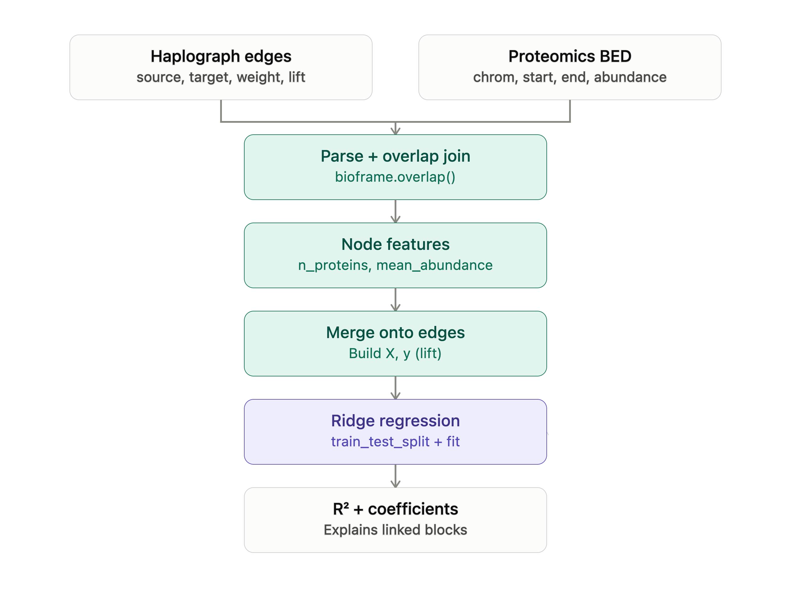
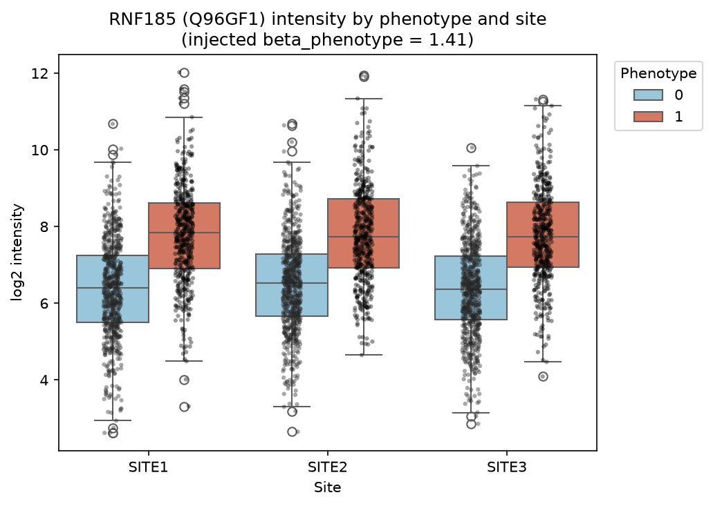
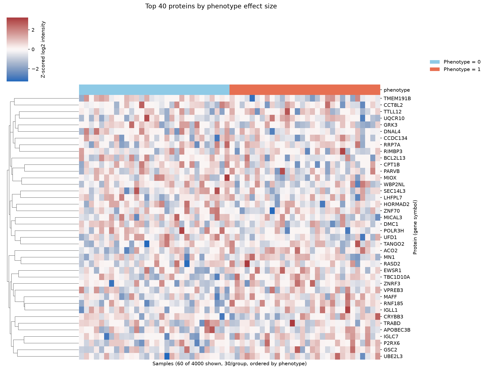
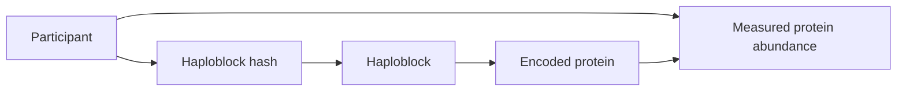

# ProGenome
*A Federated Workflow for Genome Graph and Proteomic Integration*

Genomics = variant-based phenotype-propensity reference graph to be combined with patient-specific proteomics data --> what can we learn by integrating these?

## 🎯 Our Mission

The mission of ProGenome is to develop a proof-of-concept workflow that integrates known genome-graph with proteomics, with a federated approach in mind where each participating institution retains its individual-level data locally and trains the same graph-based model. Only model updates are exchanged with a coordinating server, which aggregates them into a shared model and returns the updated parameters for the next training round.

---
## Background & Gap

Genome Graph is a tool for displaying genome-wide data sets. The genome contains the relatively stable genetic blueprint of an individual, whereas the proteome captures what's happening in cells now. Protein abundance and function can change in response to disease, treatment, environmental exposure, and physiological stress. Furthermore, one gene may give rise to multiple protein products through alternative splicing and post-translational modifications, making the proteome highly complex. In addition, pooling individual-level genomic, proteomic, and clinical data from different institutions can be restricted.

---
### Research Questions

1. How can haploblock-based genomic information be connected to genes and proteomic data in a graph-based data model?

2. Can a graph neural network combine genomic and proteomic information to identify disease-related phenotype clusters?

3. [Aspirational:] Can a graph neural network trained across multiple institutions predict clinical outcomes without transferring individual-level data?

### Brief flowchart

---
## 🚀 Quick Start (Demo)

The initial proof-of-concept demonstration will focus on chromosome 22, a test case before extending the workflow to additional chromosomes or the whole genome.

The demo will integrate haplotype information, gene information, and proteomics.

### Sept 17 workflow 

### Required Datasets

We build upon the work of previous hackathons, documented at <haploblocks.org>
From there, we leverage a graph that encodes how haploblock clusters co-occur across individuals

1. **Haploblock BED file**

   Defines the genomic coordinates and identifiers of the predefined haploblocks on chromosome 22.

   Within each haploblock, an individual's haploblock hashes will be represented (we build upon the ideas and data output from the [HaploBlock HPC pipeline project](https://github.com/MauricioMoldes/haploblocks-hpc)). These hashes provide compact identifiers that allow haplotype patterns to be compared across participants.
   Each node represents a **haploblock cluster**, i.e. haploblocks with similar genetic variants across multiple individuals.

3. **Gene BED file**

   Defines the genomic coordinates of genes located on chromosome 22. Genomic-coordinate overlap will be used to determine which genes fall within or overlap each haploblock.

4. **Gene-to-protein mapping**

   Connects chromosome 22 genes to their corresponding protein identifiers.

5. **Proteomic data**

   Proteomic data for proteins encoded by genes located on chromosome 22.*

   Before connecting to the real genomic haploblock graph, we built a synthetic proteomics dataset to validate our data structure and analysis pipeline end-to-end.

   **What we generated:**
   - Protein intensity values (log2 scale) for all ~460 unique proteins encoded by genes on chromosome 22
   - 3 simulated hospital sites, 40 patients each (120 patients total)
   - For every patient: age, sex, and a binary phenotype (case/control)
   - A deliberately injected signal: each protein's intensity depends, to varying degrees, on the patient's age, sex, and phenotype — some proteins strongly, most only weakly, to mimic real biological heterogeneity
   
   This lets us check whether our analysis can actually recover a known signal before applying it to real data later on.
   
   **Result:** the injected phenotype effect is clearly recoverable, and consistent across all 3 simulated sites:
   
   
   
   A broader view across the 40 proteins most influenced by age/sex/phenotype shows visible structure separating the two phenotype groups:
   
   
   
   This confirms the proteomics side of the pipeline behaves as expected, and gives us matched patient-level data (age, sex, phenotype, protein intensities) ready to be connected to the genomic haploblock hashes.

### Data Integration

The integrated graph will represent relationships among participants, haplotype patterns, haploblocks, genes, and proteins:

For example, the graph may represent that a participant carries a particular haplotype pattern within a chromosome 22 haploblock, that the gene encodes a particular protein, and that the participant has a measured abundance value for that protein.

---
## Team members

- Friederike Duendar
- Zillur Rahman
- Anita Egebor
- Yan Zhou
- Alvaro Martinez Barrio
- Kumar Koushik Telaprolu 
- Nolan Bruyat
