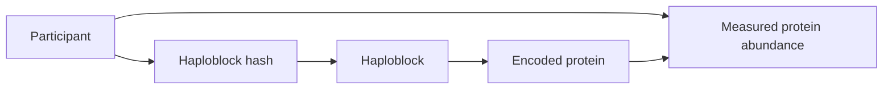

# ProGenome
*A Federated Workflow for Genome Graph and Proteomic Integration*

📊 **Presentation slides:** [Team 3: ProGenome (Google Slides)](https://docs.google.com/presentation/d/13wHiF-xPHeDyy7XYMmTSwxAYUswgSutH7x7dZ02SOOs/edit) · 📄 **Genomics methods and results:** [genomics/RESULTS.md](genomics/RESULTS.md)

[](https://www.python.org/)
[](https://pytorch.org/)
[](https://pyg.org/)
[](https://developer.nvidia.com/cuda-toolkit)
[](genomics/Dockerfile)
[](https://github.com/NVIDIA/NVFlare)
[](https://build.nvidia.com/)
[](https://brev.nvidia.com/)
[](https://neo4j.com/)
[](https://networkx.org/)
[](https://data.haploblocks.org/haplograph/1000G/)
[](genomics/tests/)
[](https://github.com/collaborativebioinformatics/ProGenome)


## 🎯 Our Mission
To develop a federated workflow that integrates haploblock-based genome-graph with proteomic data from each participating institution.


## 🚀 Quick Start (Demo)

The initial proof-of-concept demonstration will focus on chromosome 22, a test case before extending the workflow to additional chromosomes or the whole genome.

The demo will integrate haplotype information, gene information, and proteomics.

### Required Datasets

We build upon the work of previous hackathons, documented at <haploblocks.org>
From there, we leverage a graph that encodes how haploblock clusters co-occur across individuals


1. **Haploblock BED file**

   Defines the genomic coordinates and identifiers of the predefined haploblocks on chromosome 22.

   Within each haploblock, an individual's haploblock hashes will be represented (we build upon the ideas and data output from the [HaploBlock HPC pipeline project](https://github.com/MauricioMoldes/haploblocks-hpc)). These hashes provide compact identifiers that allow haplotype patterns to be compared across participants.
   Each node represents a **haploblock cluster**, i.e. haploblocks with similar genetic variants across multiple individuals.

3. **Gene BED file**

   Defines the genomic coordinates of genes located on chromosome 22. Genomic-coordinate overlap will be used to determine which genes fall within or overlap each haploblock.

4. **Gene-to-protein mapping**

   Connects chromosome 22 genes to their corresponding protein identifiers.

5. **Proteomic data**

   Proteomic data for proteins encoded by genes located on chromosome 22.*

   Before connecting to the real genomic haploblock graph, we built a synthetic proteomics dataset to validate our data structure and analysis pipeline end-to-end.

### *What we generated
   - Protein intensity values (log2 scale) for all ~460 unique proteins encoded by genes on chromosome 22
   - 3 simulated hospital sites, 4000 patients total
   - For every patient: age, sex, and a binary phenotype (case/control)
   - A deliberately injected signal: each protein's intensity depends, to varying degrees, on the patient's age, sex, and phenotype — some proteins strongly, most only weakly, to mimic real biological heterogeneity
   
   **Result:** the injected phenotype effect is clearly recoverable, and consistent across all 3 simulated sites:
   
   
   
   A broader view across the 40 proteins most influenced by age/sex/phenotype shows visible structure separating the two phenotype groups:
   
   
   
   This confirms the proteomics side of the pipeline behaves as expected, and gives us matched patient-level data (age, sex, phenotype, protein intensities) ready to be connected to the genomic haploblock hashes.

### Data Integration

The integrated graph will represent relationships among participants, haplotype patterns, haploblocks, genes, and proteins:



### Reproducible proteomics analysis

The new 4,000-sample synthetic matrices can be analyzed with:

```bash
python scripts/analyze_proteomics.py
python scripts/build_knowledge_graph.py
```

The analysis writes filtered-protein lists, five-fold cross-validation and
held-out test metrics, confusion-matrix and coefficient figures to
`proteomics/logistic_regression_results/`. The graph script writes node/edge
tables and a top-protein visualization to `proteomics/knowledge_graph/`.
Pass `--edges path/to/edges_lift_above_threshold_uniprot.csv.gz` to the graph
script when the annotated haplograph edge file is available.

For example, the graph may represent that a participant carries a particular haplotype pattern within a chromosome 22 haploblock, that the gene encodes a particular protein, and that the participant has a measured abundance value for that protein.

---
## Team members

- Friederike Duendar
- Zillur Rahman
- Anita Egebor
- Yan Zhou
- Alvaro Martinez Barrio
- Kumar Koushik Telaprolu 
- Nolan Bruyat
