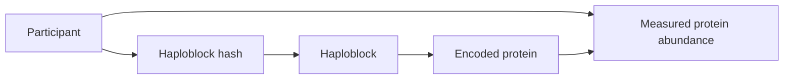

# ProGenome
*A Federated Workflow for Genome Graph and Proteomic Integration*

Genomics = variant-based phenotype-propensity reference graph to be combined with patient-specific proteomics data --> what can we learn by integrating these?

## 1. Background & Gap

Genome Graph is a tool for displaying genome-wide data sets. The genome contains the relatively stable genetic blueprint of an individual, whereas the proteome captures what's happening in cells now. Protein abundance and function can change in response to disease, treatment, environmental exposure, and physiological stress. Furthermore, one gene may give rise to multiple protein products through alternative splicing and post-translational modifications, making the proteome highly complex.

Although genome graphs can describe genetic variation, they do not by themselves indicate which molecular processes are active. Proteomic datasets provide complementary functional information, but they are high-dimensional and often distributed across hospitals and research institutions. Pooling individual-level genomic, proteomic, and clinical data in a single location can be restricted.

## 2. ProGenome Mission

The mission of ProGenome is to develop a proof-of-concept federated workflow that integrates known genome-graph with proteomics. Each participating institution retains its individual-level data locally and trains the same graph-based model. Only model updates are exchanged with a coordinating server, which aggregates them into a shared model and returns the updated parameters for the next training round.

### Research Questions

1. How can haploblock-based genomic information be connected to genes and proteomic data in a graph-based data model?

2. Can a graph neural network combine genomic and proteomic information to identify disease-related phenotype clusters?

3. Can a graph neural network trained across multiple institutions predict clinically outcomes without transferring individual-level data?

### Brief flowchart

## 3. Demo

The initial proof-of-concept demonstration will focus on chromosome 22, a test case before extending the workflow to additional chromosomes or the whole genome.

The demo will integrate haplotype information, gene information, and proteomics.

### Required Datasets

1. **Haploblock BED file**

   Defines the genomic coordinates and identifiers of the predefined haploblocks on chromosome 22.

   Within each haploblock, an individual's haploblock hashes will be represented (link and example needed). These hashes provide compact identifiers that allow haplotype patterns to be compared across participants.

2. **Gene BED file**

   Defines the genomic coordinates of genes located on chromosome 22. Genomic-coordinate overlap will be used to determine which genes fall within or overlap each haploblock.

3. **Gene-to-protein mapping**

   Connects chromosome 22 genes to their corresponding protein identifiers.

4. **Proteomic data**

   Proteomic data for proteins encoded by genes located on chromosome 22.

### Data Integration

The integrated graph will represent relationships among participants, haplotype patterns, haploblocks, genes, and proteins:

For example, the graph may represent that a participant carries a particular haplotype pattern within a chromosome 22 haploblock, that the gene encodes a particular protein, and that the participant has a measured abundance value for that protein.

## Team members

- Friederike Duendar
- Zillur Rahman
- Anita Egebor
- Yan Zhou
- Alvaro Martinez Barrio
- Kumar Koushik Telaprolu 
- Nolan Bruyat
