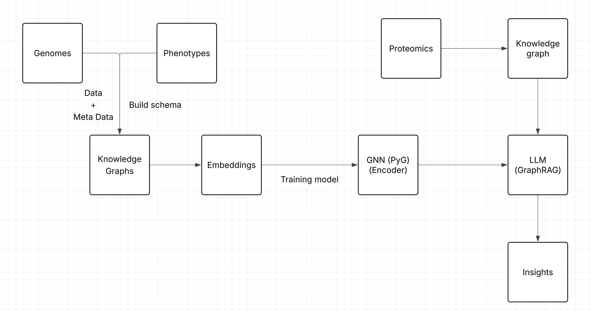
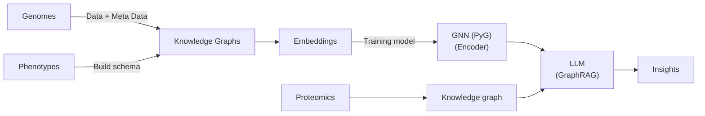

# Integrating graph genomes and proteomes

Genomics = variant-based phenotype-propensity reference graph to be combined with patient-specific proteomics data --> what can we learn by integrating these?

## Team members

- Friederike Duendar
- Zillur Rahman
- Anita Egebor
- Yan Zhou
- Alvaro Martinez Barrio
- Kumar Koushik Telaprolu 
- Nolan Bruyat

## Architecture Overview

