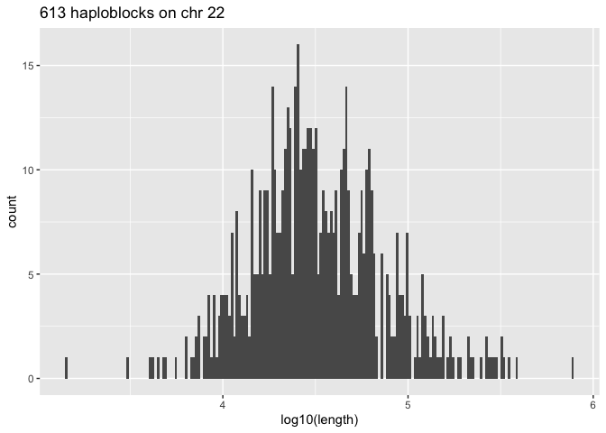
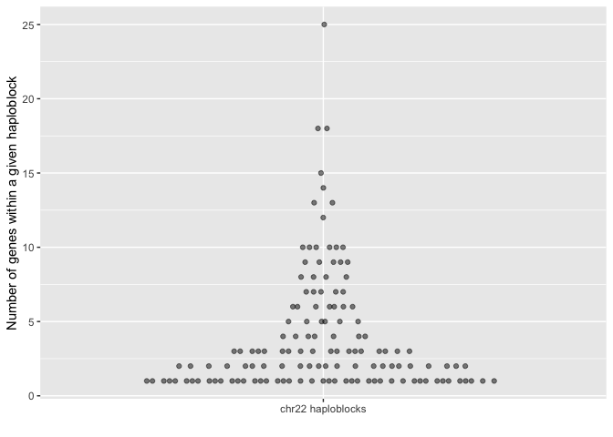

Haploblocks and Genes within them
================
Friederike Duendar
2026-09-17

- [Reading data of the haploblocks](#reading-data-of-the-haploblocks)
- [Genes of chr22](#genes-of-chr22)
- [Which genes overlap with the
  haploblocks?](#which-genes-overlap-with-the-haploblocks)

``` r
library(data.table)
```

    ## 
    ## Attaching package: 'data.table'

    ## The following object is masked from 'package:base':
    ## 
    ##     %notin%

``` r
library(ggplot2)
library(magrittr)
```

## Reading data of the haploblocks

``` r
phenotypes <- fread("https://data.haploblocks.org/haplograph/1000G/phenotypes_real.csv")
edges_chr2 <- fread("https://data.haploblocks.org/haplograph/1000G/chr22/edges_lift_above_threshold.csv.gz")
haplos_chr22 <- edges_chr2[, 1]
haplos_chr22[, chr := "chr22"]
haplos_chr22[, start := gsub("chr22_([0-9]+)-.+", "\\1", source) %>% as.integer()]
haplos_chr22[, end := gsub("chr22_([0-9]+)-(.+[0-9]+)_.+", "\\2", source) %>% as.integer]
haplos_chr22[, length:= end-start]
## turn into data.table's closed interval format
haplos_chr22[, start := start+1L]
haplos_chr22 <- haplos_chr22[, .(chr, start, end, length)] %>% unique
```

Haploblock lengths

``` r
ggplot(haplos_chr22, aes(x = log10(length))) +
  geom_histogram(bins = 200) +
  ggtitle("613 haploblocks on chr 22")
```

<!-- -->

## Genes of chr22

``` r
genes_chr22 <- fread("/Users/friederikeduendar/Documents/ProGenome/proteomics/uniprot_chr22.bed")
setnames(genes_chr22, names(genes_chr22), c("chr","start","end","UniprotID","score","strand"))

## turn into data.table's closed interval format
genes_chr22[, start := start+1L]

#prots <- fread("/Users/friederikeduendar/Documents/ProGenome/proteomics/synthetic_proteomics_chr22/sample_metadata.csv")
```

## Which genes overlap with the haploblocks?

``` r
setkey(genes_chr22, chr, start, end)
setkey(haplos_chr22, chr, start, end)
genes_chr22[, geneRow_id := .I]
haplos_chr22[, haplo_id := .I]

hits <- foverlaps(
  x       = genes_chr22,
  y       = haplos_chr22,
  by.x    = c("chr", "start", "end"),
  by.y    = c("chr", "start", "end"),
  type    = "within",
  which   = TRUE,
  nomatch = NULL
)

overlapping_regions <- cbind(
  haplos_chr22[hits$yid, .(haplo_id, chr, haplo_start = start, haplo_end = end)],
  genes_chr22[hits$xid, .(geneRow_id, gene_start = start, gene_end = end)]
)
```

How many genes per haploblock?

``` r
overlapping_regions[, .N, haplo_id] %>%
  ggplot(., aes(y = N, x = "chr22 haploblocks")) +
  ggbeeswarm::geom_quasirandom(alpha = 0.5) +
  xlab("") + ylab("Number of genes within a given haploblock")
```

<!-- -->
