# ProGenome genomics: Methods and Results (chromosome 22)

*Person-level knowledge graph of haploblock clusters, genes and proteins; a heterogeneous GNN encoder; an LLM decoder;
federated training with NVIDIA FLARE.* This page renders on GitHub and is meant to be presented from directly. Every
number comes from files under `genomics/outputs*/` (chr22, seed 42); the diagrams are Mermaid (rendered by GitHub), the
plots are in `docs/report/figures/` and are regenerated by `make report`. The companion documents are the [README](README.md) (implementation guide), the
[knowledge-transfer report](docs/report/ProGenome_KT.pdf) (40 pages), the [deep dive](docs/DEEP_DIVE.md) (formulas) and the
[presentation slides](https://docs.google.com/presentation/d/13wHiF-xPHeDyy7XYMmTSwxAYUswgSutH7x7dZ02SOOs/edit).

**In one sentence:** we joined the published 1000 Genomes HaploGraph to real labels and to per-site proteomics through
the sample id, trained a graph neural network on the resulting person-level graph, showed that genome + proteome through
the graph predicts a phenotype better than either alone (AUC 0.60 / 0.96 / 0.99) while negative controls stay at chance,
turned the model's outputs into cited per-person reports with an NVIDIA NIM language model, and trained the same model
federated across three sites with no loss (AUC 0.987-0.998 vs central 0.992-0.995).

---

## 1. Goal

The team README asks three questions. This is how they were operationalised and what was achieved:

| RQ | Question | Operational form | Status |
|---|---|---|---|
| 1 | How can haploblock genomics connect to genes and proteomics in a graph model? | one typed graph: Individual, Cluster, Block, Gene, Protein; seven edge types; joined by the 1000G sample id | done (schema v2, browsable in Neo4j) |
| 2 | Can a GNN combine genomic and proteomic information to identify disease-related phenotype clusters? | ablation genome / proteome / both on a synthetic phenotype with saved ground truth; controls; saliency against the planted causal clusters | done: 0.60 / 0.96 / 0.99 AUC; controls at chance; top-3 salient clusters all causal |
| 3 | Can it be trained across institutions without transferring individual-level data? | NVFlare FedAvg, three sites, only weights exchanged, scored on the same held-out people as the central model | done in simulation: 0.987-0.998 vs 0.992-0.995 |

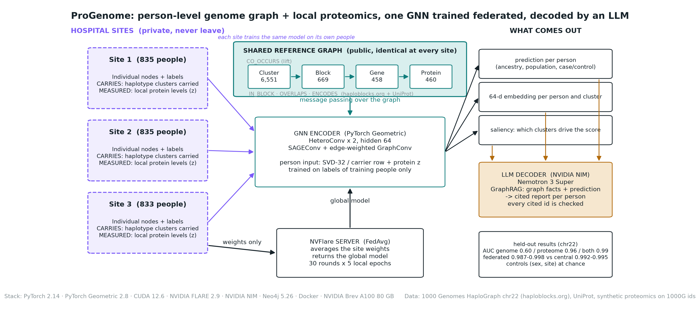

*Figure 0. System architecture: private hospital sites on the left, the shared reference graph and the GNN encoder trained through the NVFlare server in the middle, the model's outputs and the LLM decoder on the right.*

**v1: genome graph to phenotypes** (`make run`)

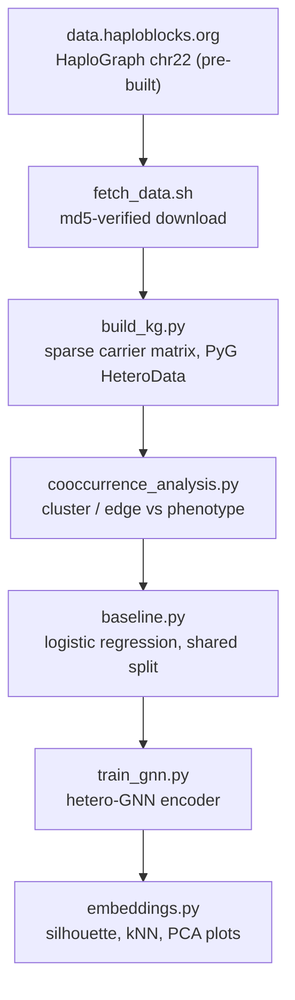
```mermaid
flowchart TB
  A["data.haploblocks.org<br/>HaploGraph chr22 (pre-built)"] --> B["fetch_data.sh<br/>md5-verified download"] --> C["build_kg.py<br/>sparse carrier matrix, PyG HeteroData"] --> D["cooccurrence_analysis.py<br/>cluster / edge vs phenotype"] --> E["baseline.py<br/>logistic regression, shared split"] --> F["train_gnn.py<br/>hetero-GNN encoder"] --> G["embeddings.py<br/>silhouette, kNN, PCA plots"]
```

**v2: proteomics, integration, decoder, federated** (`make run-v2`, `make federated`)

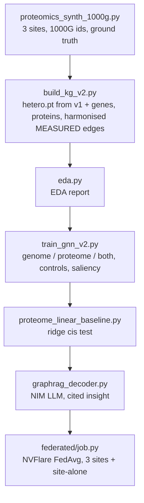
```mermaid
flowchart TB
  H["proteomics_synth_1000g.py<br/>3 sites, 1000G ids, ground truth"] --> I["build_kg_v2.py<br/>hetero.pt from v1 + genes, proteins, harmonised MEASURED edges"] --> J["eda.py<br/>EDA report"] --> K["train_gnn_v2.py<br/>genome / proteome / both, controls, saliency"] --> L["proteome_linear_baseline.py<br/>ridge cis test"] --> M["graphrag_decoder.py<br/>NIM LLM, cited insight"] --> N["federated/job.py<br/>NVFlare FedAvg, 3 sites + site-alone"]
```

*Figure 1. The two pipeline chains. Each box is one script with a Makefile target; outputs land under `outputs/<stage>/chr22/`.*

---

## 2. Data

| Data | Source | Content | Role |
|---|---|---|---|
| HaploGraph nodes | data.haploblocks.org/haplograph/1000G/chr22 | 248,254 haplotype clusters x 2,548 people, 0/1 carrier matrix | person-to-cluster edges (CARRIES) |
| HaploGraph edges | same | 187,030 cluster pairs with weight and lift >= 5 | cluster-to-cluster edges (CO_OCCURS) |
| Block statistics | same | 669 recombination-defined blocks, 17.1-50.2 Mb, length, entropy, dominance | Block nodes |
| Phenotypes | 1000G panel, republished with the graph | ancestry (5), population (26), sex for 2,503 people | labels on the person node; never edges |
| Gene / protein BED | UCSC UniProt track (team) | 917 isoform rows -> 458 genes, 460 proteins | Gene, Protein nodes; OVERLAPS, ENCODES |
| Proteomics (synthetic, joinable) | `proteomics_synth_1000g.py` | 2,503 real 1000G ids, 3 mixed-ancestry sites, 460 proteins, phenotype driven by 20 causal clusters, cis effects, batch shift, missingness; `ground_truth.json` | MEASURED edges, person features, site and phenotype labels, ground truth |
| Proteomics (team, SITE ids) | `proteomics/` on main | 4,000 patients, not 1000G ids | validated the proteomics side; cannot join the genome |

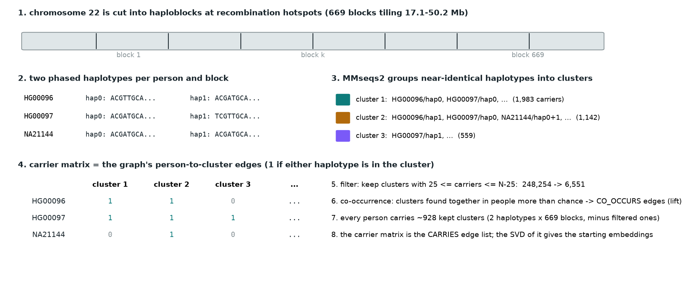

*Figure 2. Upstream (haploblocks.org): blocks from recombination peaks, phased haplotypes per person and block, MMseqs2
clusters, the carrier matrix; our symmetric support filter keeps 6,551 clusters and reproduces the edge file's node set
exactly.*

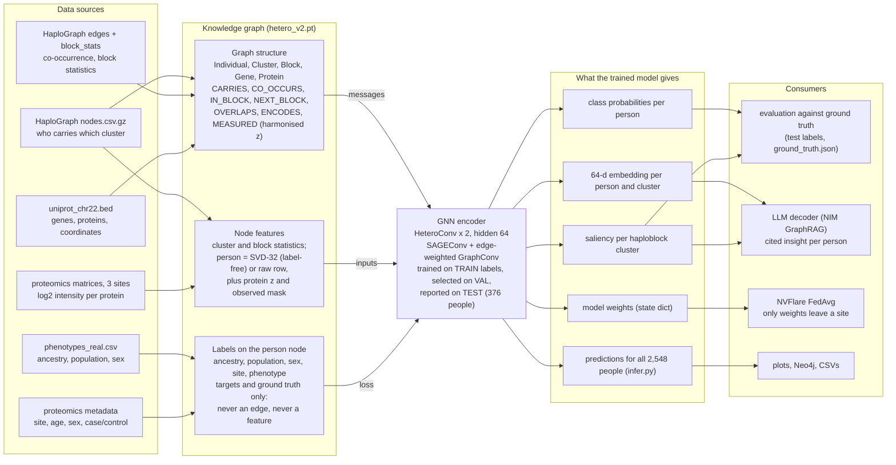
```mermaid
flowchart LR
  subgraph S ["Data sources"]
    S1["HaploGraph nodes.csv.gz<br/>who carries which cluster"]
    S2["HaploGraph edges + block_stats<br/>co-occurrence, block statistics"]
    S3["phenotypes_real.csv<br/>ancestry, population, sex"]
    S4["uniprot_chr22.bed<br/>genes, proteins, coordinates"]
    S5["proteomics matrices, 3 sites<br/>log2 intensity per protein"]
    S6["proteomics metadata<br/>site, age, sex, case/control"]
  end
  subgraph K ["Knowledge graph (hetero_v2.pt)"]
    K1["Graph structure<br/>Individual, Cluster, Block, Gene, Protein<br/>CARRIES, CO_OCCURS, IN_BLOCK, NEXT_BLOCK,<br/>OVERLAPS, ENCODES, MEASURED (harmonised z)"]
    K2["Node features<br/>cluster and block statistics;<br/>person = SVD-32 (label-free) or raw row,<br/>plus protein z and observed mask"]
    K3["Labels on the person node<br/>ancestry, population, sex, site, phenotype<br/>targets and ground truth only:<br/>never an edge, never a feature"]
  end
  E["GNN encoder<br/>HeteroConv x 2, hidden 64<br/>SAGEConv + edge-weighted GraphConv<br/>trained on TRAIN labels, selected on VAL,<br/>reported on TEST (376 people)"]
  subgraph O ["What the trained model gives"]
    O1["class probabilities per person"]
    O2["64-d embedding per person and cluster"]
    O3["saliency per haploblock cluster"]
    O4["model weights (state dict)"]
    O5["predictions for all 2,548 people (infer.py)"]
  end
  subgraph U ["Consumers"]
    U1["evaluation against ground truth<br/>(test labels, ground_truth.json)"]
    U2["LLM decoder (NIM GraphRAG)<br/>cited insight per person"]
    U3["NVFlare FedAvg<br/>only weights leave a site"]
    U4["plots, Neo4j, CSVs"]
  end
  S1 --> K1
  S2 --> K1
  S4 --> K1
  S1 --> K2
  S5 --> K2
  S3 --> K3
  S6 --> K3
  K1 -- "messages" --> E
  K2 -- "inputs" --> E
  K3 -- "loss" --> E
  E --> O1
  E --> O2
  E --> O3
  E --> O4
  E --> O5
  O1 --> U1
  O3 --> U1
  O2 --> U2
  O3 --> U2
  O4 --> U3
  O5 --> U4
```

*Figure 3. Where each data source enters and what the trained model produces. Phenotypes are targets and ground truth
only; the encoder can reach a label only through the loss on training people.*

---

## 3. Methods

### 3.1 Knowledge graph

The HaploGraph has one node type (cluster) with people as a feature vector. We made the person a node type of its own,
which is what lets labels and protein measurements attach to a person and what makes the graph federatable: the
cluster / block / gene / protein layer is public and identical everywhere, a site holds only its people and their edges.

| Node | Count | Edge | Count |
|---|---|---|---|
| Individual {ancestry, population, sex, site, phenotype} | 2,548 | Individual CARRIES Cluster | 2,365,574 |
| Cluster {support, block statistics} | 6,551 | Cluster CO_OCCURS {weight, lift} Cluster | 187,030 |
| Block {length, n_clusters, entropy, dominance} | 669 | Cluster IN_BLOCK Block; Block NEXT_BLOCK Block | 6,551; 668 |
| Gene | 458 | Block OVERLAPS Gene; Gene ENCODES Protein | 1,063; 460 |
| Protein | 460 | Individual MEASURED {log2, z} Protein (missing = no edge) | 1,065,712 |

Cluster filter: keep a cluster if 25 <= carriers <= N - 25 (248,254 -> 6,551; 0 of 187,030 edges lose an endpoint).
Protein levels are harmonised per site and protein (robust z = (x - median) / (1.4826 MAD)) before entering the graph;
the between-site shift goes from 0.48 to 0.00 log2 while 227 proteins keep a phenotype association at FDR 5 %.

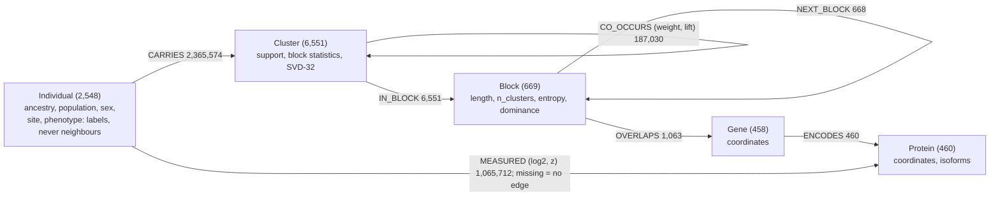
```mermaid
flowchart LR
  I["Individual (2,548)<br/>ancestry, population, sex,<br/>site, phenotype: labels, never neighbours"]
  C["Cluster (6,551)<br/>support, block statistics, SVD-32"]
  B["Block (669)<br/>length, n_clusters, entropy, dominance"]
  G["Gene (458)<br/>coordinates"]
  P["Protein (460)<br/>coordinates, isoforms"]
  I -- "CARRIES 2,365,574" --> C
  C -- "CO_OCCURS (weight, lift) 187,030" --> C
  C -- "IN_BLOCK 6,551" --> B
  B -- "NEXT_BLOCK 668" --> B
  B -- "OVERLAPS 1,063" --> G
  G -- "ENCODES 460" --> P
  I -- "MEASURED (log2, z) 1,065,712; missing = no edge" --> P
```

*Figure 4. The schema with chr22 counts. Labels live on the Individual node, never as neighbours (a label neighbour would
let a two-layer GNN read the answer and report a meaningless 100 %).*

### 3.2 Statistics before modelling

For every cluster and label a 2 x k contingency test (Cramer's V = sqrt(chi2 / N)) with Benjamini-Hochberg FDR, all
6,551 tests in one sparse matrix product; for every edge the cosine similarity of the endpoints' ancestry-enrichment
profiles against a degree-preserving shuffled null.

### 3.3 Embeddings and the GNN encoder

Starting vectors: cluster and block statistics; for people and clusters a label-free 32-component SVD of the carrier
matrix (rows of U S and V S share one space). Alternatives compared: Node2Vec (pyg-lib, 50 epochs), free learned
embeddings, the raw carrier row.

Encoder: PyTorch Geometric `HeteroConv`, two layers, hidden 64; `SAGEConv` (neighbour mean) on carries, in_block,
next_block, overlaps, encodes in both directions; `GraphConv` with edge weights on co_occurs (normalised log lift) and
measured (harmonised z, signed); LayerNorm + residual + ReLU + dropout 0.3 per layer; linear head on the person vector.
Class-weighted cross-entropy on training people only, Adam 5e-3, weight decay 5e-4, early stopping on validation
balanced accuracy (patience 30). Full batch: one epoch is one pass over the graph (0.95 s on an M2 CPU, 0.10 s on an A100).

### 3.4 Evaluation protocol and controls

One stratified 70/15/15 split over the 2,503 labelled people (seed 42), written once and reused by every model, so all
held-out numbers are on the same 376 people. Two negative controls are part of the design: **sex** (chr22 is autosomal,
so any signal is noise) and **site** (sites are mixed-ancestry random partitions, so any signal is batch). Metrics:
balanced accuracy (mean per-class recall), ROC-AUC for binary targets, macro-F1, silhouette and 5-NN accuracy for
embeddings, precision at 20 for saliency, R2 per protein for regression.

### 3.5 Synthetic proteome with ground truth

Per person (real 1000G id, real sex, random age, site by shuffling within ancestry): case/control logit = weighted sum over
20 causal clusters (beta ~ N(0, 1.5)) + small age term, calibrated to 38 % cases; each causal cluster shifts one protein
in its own block (cis, beta ~ N(0, 1)); 15 % of proteins respond to the phenotype (beta ~ N(0, 0.5)); age, sex, site
shift (sd 0.3) and biological + technical noise; missingness rising toward the detection limit (MNAR). The first version
shifted every protein with the phenotype and every model scored 1.0; the signal was made sparse on purpose.

### 3.6 Decoder (GraphRAG with NVIDIA NIM)

For one person, deterministic retrieval from the graph (profile with the true phenotype withheld, the GNN prediction,
salient clusters carried, the 8 most ancestry-informative clusters with block / genes / proteins, the 8 most extreme
protein levels with their encoding block, the 5 nearest people in the embedding) -> JSON (~4.5 k tokens) ->
`nvidia/nemotron-3-super-120b-a12b` on the OpenAI-compatible NIM endpoint (`reasoning_effort=none`, temperature 0.2)
under a system prompt that forbids new entities and requires every id verbatim -> cited ids validated against the context.

### 3.7 Federated learning (NVIDIA FLARE 2.9)

`FedAvgRecipe` + `SimEnv`, three sites (835 / 835 / 833 people, mixed ancestry). Each client builds its site subgraph
(`HeteroData.subgraph` over its own people; public node types kept whole), receives the global weights, evaluates them on
its own validation and test people, trains five full-batch epochs with local class weights and sends back weights,
metrics and the step count; the server averages (step-weighted) and keeps the best model by validation balanced
accuracy. Per round per site only one state dict (~0.5 M floats) and five scalars cross the boundary. The global model
is then scored centrally on the same 376 held-out people as the central model, and `local_only.py` trains each site alone
for the same 150 steps as the reference.

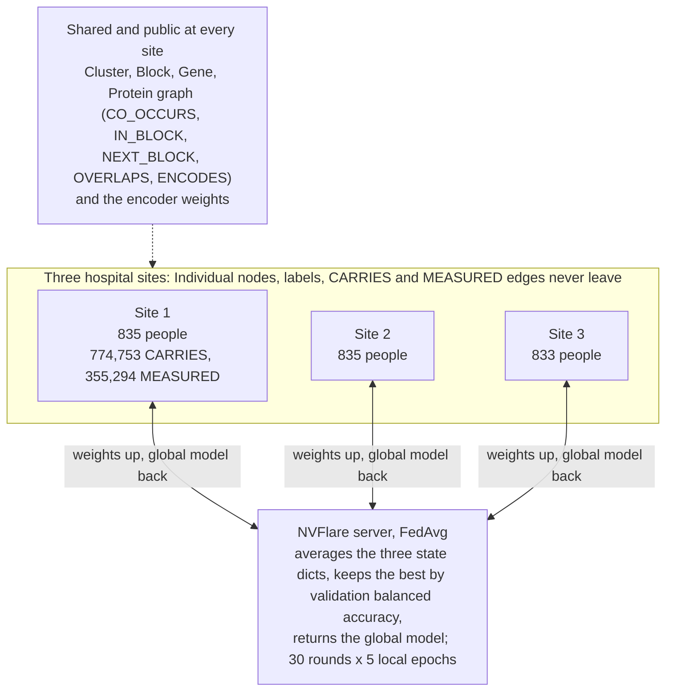
```mermaid
flowchart TB
  SHARED["Shared and public at every site<br/>Cluster, Block, Gene, Protein graph (CO_OCCURS, IN_BLOCK, NEXT_BLOCK, OVERLAPS, ENCODES)<br/>and the encoder weights"]
  subgraph SITES ["Three hospital sites: Individual nodes, labels, CARRIES and MEASURED edges never leave"]
    direction LR
    A["Site 1<br/>835 people<br/>774,753 CARRIES, 355,294 MEASURED"]
    B["Site 2<br/>835 people"]
    C["Site 3<br/>833 people"]
  end
  SRV["NVFlare server, FedAvg<br/>averages the three state dicts, keeps the best by validation balanced accuracy,<br/>returns the global model; 30 rounds x 5 local epochs"]
  SHARED -.-> SITES
  A <-- "weights up, global model back" --> SRV
  B <-- "weights up, global model back" --> SRV
  C <-- "weights up, global model back" --> SRV
```

*Figure 5. Three sites with private people and edges, one shared public graph, weights only to the server.*

### 3.8 Compute and packaging

Python 3.13, PyTorch 2.14, PyG 2.8, pyg-lib, scikit-learn, scipy sparse, NetworkX (+ nx-cugraph), Neo4j 5.26; Docker
image `pytorch/pytorch:2.14.0-cuda12.6-cudnn9-runtime` + PyG + nx-cugraph + torch-tensorrt + NVFlare, built from the
repository root with the proteomics inputs baked in and the unit tests run at build time; NVIDIA Brev L4 and A100 80 GB;
`config.py` + `.env.example` as the single credential entry point; Makefile targets for every stage.

---

## 4. Results

### 4.1 The graph carries phenotype information, and the control is clean

| Test | Ancestry | Population | Sex (control) |
|---|---|---|---|
| Clusters associated at FDR 5 % | 6,470 / 6,551 (98.8 %) | 6,378 (97.4 %) | **0** |
| Median / max Cramer's V | 0.20 / 0.81 | 0.24 / - | 0.013 / 0.03 |

Edges: cosine similarity of endpoint ancestry profiles 0.86 (real) vs 0.22 (shuffled); 86 % of edges join clusters
enriched in the same ancestry (42 % expected); similarity rises with lift (0.84 -> 0.90 by quartile). The co-occurrence
graph is largely population structure: long-range co-inheritance within ancestries, not physical linkage.

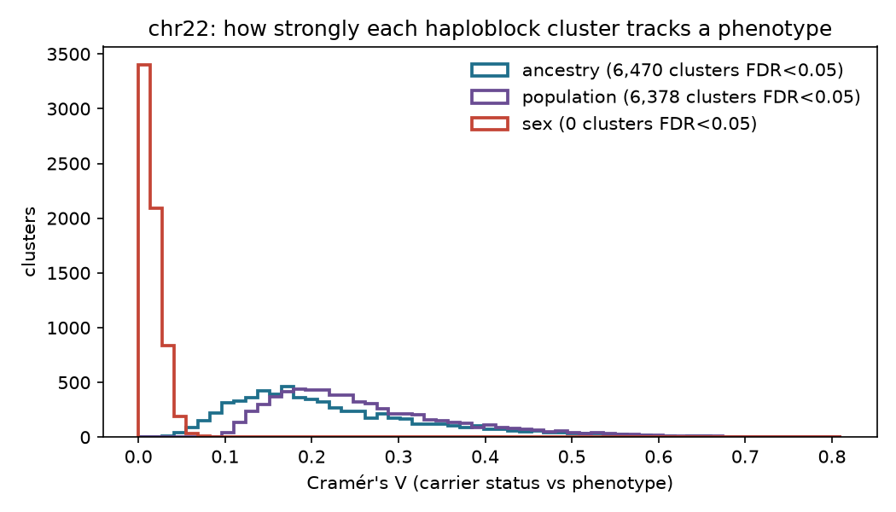

*Figure 6. Per-cluster association with each label. Ancestry and population carry signal; sex does not.*

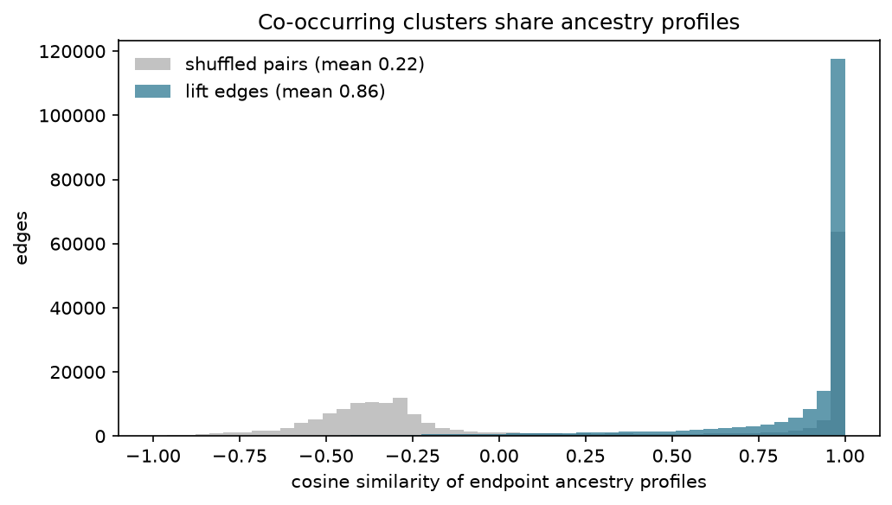

*Figure 7. Co-occurring clusters share ancestry-enrichment profiles; shuffled pairs do not.*

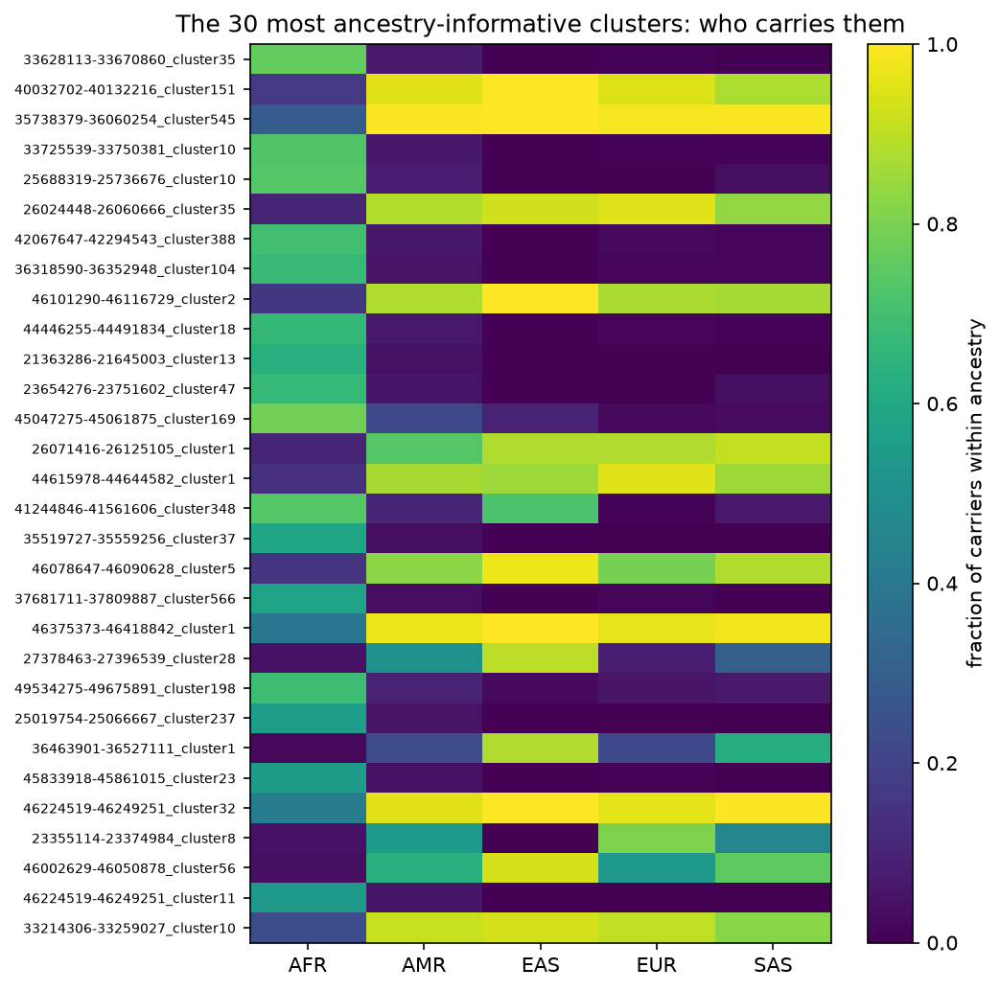

*Figure 8. The 30 most ancestry-informative clusters and the fraction of each ancestry that carries them.*

### 4.2 Real labels: the GNN ties the linear baseline on accuracy and the control stays at chance

| Target (real labels) | Classes | Logistic regression | GNN (SVD input) |
|---|---|---|---|
| ancestry | 5 | 0.977 | 0.974 |
| population | 26 | 0.614 | 0.437 (0.611 with the raw carrier row) |
| sex, negative control | 2 | 0.463 | 0.503 |

Balanced accuracy on the 376 held-out people. On chr22 alone ancestry is almost a linear function of which clusters a
person carries, so the GNN cannot beat logistic regression on accuracy here; its value is the embedding space (4.3) and
the integration (4.4).

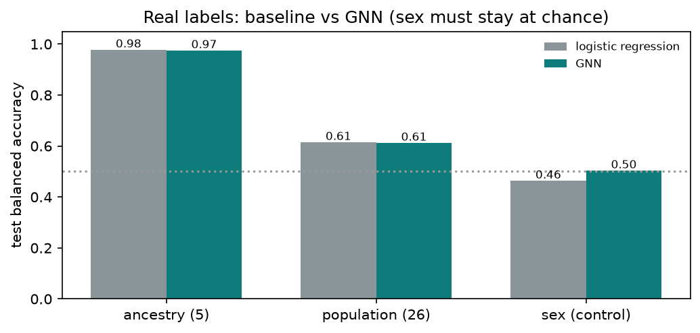

*Figure 9. Real labels: logistic regression versus the GNN; sex at chance for both.*

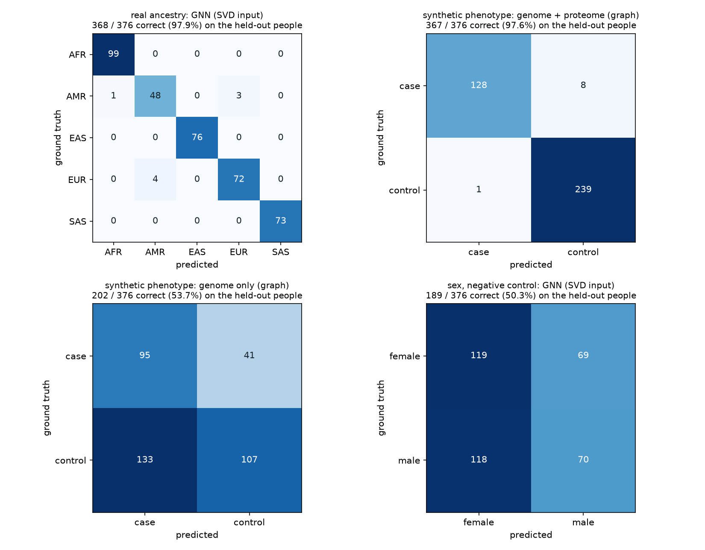

*Figure 10. Ground truth versus prediction on the held-out people. Ancestry: 368 / 376 correct, the eight errors all
between AMR and EUR (admixture). Synthetic phenotype: genome + proteome through the graph 367 / 376 with one false case;
genome alone 202 / 376. Sex: a coin flip, as it must be.*

### 4.3 Embeddings: what the GNN adds

| Space | Silhouette by ancestry | 5-NN balanced accuracy |
|---|---|---|
| SVD-32 (label-free start) | 0.06 | 0.90 |
| GNN hidden layer, ancestry run | **0.70** | **0.97** |
| GNN with free learned embeddings | 0.33 | 0.61 |

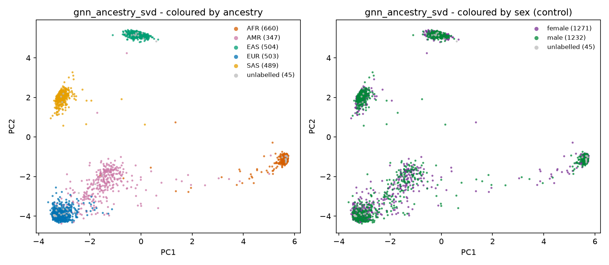

*Figure 11. The GNN's 64-d embedding of people in two dimensions: five ancestries separate, AMR spread between EUR and
AFR as admixture predicts; coloured by sex the same points are fully mixed.*

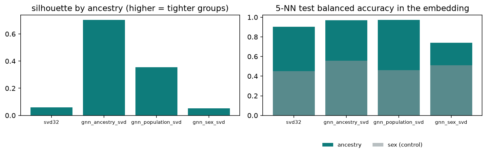

*Figure 12. Silhouette and nearest-neighbour accuracy for SVD and for each GNN's hidden layer.*

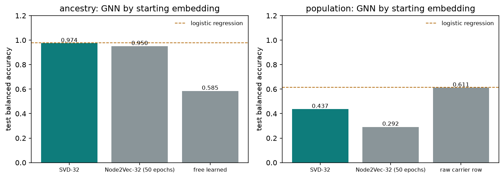

*Figure 13. The same GNN with different starting embeddings. SVD is the best start (ancestry 0.974); Node2Vec with 50
pretraining epochs is a working but weaker alternative (0.950); free learned embeddings fail (0.585); the raw carrier
row is best for the 26-class population target (0.611).*

### 4.4 Integration: genome + proteome through the graph beats either alone

Synthetic phenotype with saved ground truth; same 376 held-out people; AUC.

| Model | Input to the person node | Relations | AUC | Balanced accuracy |
|---|---|---|---|---|
| genome only (graph) | SVD-32 or raw carrier row | genome relations | 0.60-0.65 | 0.57-0.62 |
| proteome only (MLP, no graph) | harmonised z + observed mask | none | 0.96 | 0.96 |
| **genome + proteome (graph)** | both | all twelve | **0.99** | **0.95-0.97** |
| site, batch control (full graph) | both | all | - | 0.30-0.34 (chance 0.33) |
| ancestry (full graph) | both | all | - | 0.89-0.90 |

Saliency (gradient of the case score w.r.t. the carrier row, averaged over test cases): the top three clusters are all
among the 20 planted causal clusters out of 6,551, four of the top twenty are (0.06 expected by chance).

Genome -> proteome, kept as a negative result: regressing the 460 protein z-scores from the person embedding gives R2 ~ 0
even for cis-affected proteins, while a per-protein ridge on the carrier row recovers 4 of 20 cis proteins at test
R2 > 0.1 and 0 of 440 others; the data's own ceiling (r2 between carrying the causal cluster and its protein) is 0.54
max, 0.17 mean. The GNN is the integration and embedding tool; cis discovery wants sparse per-protein models or a
pQTL edge prior.

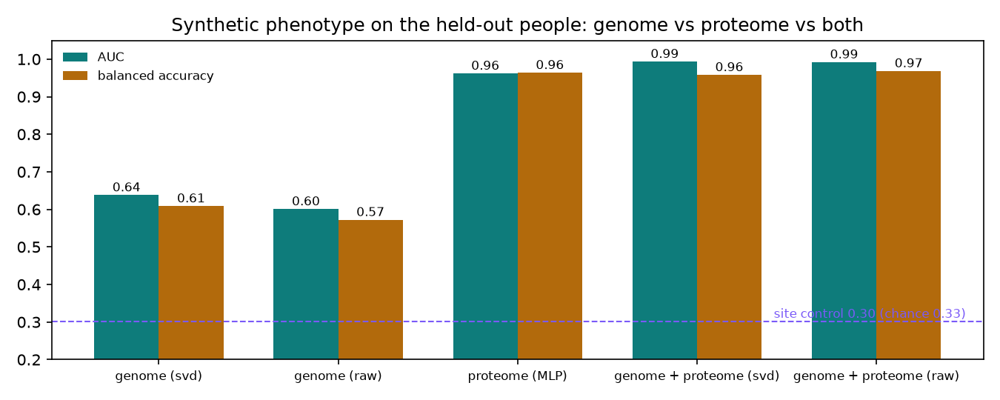

*Figure 14. Held-out AUC and balanced accuracy by modality; the site control sits at chance.*

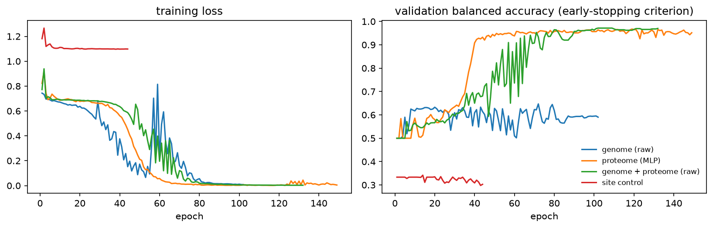

*Figure 15. Training loss and validation balanced accuracy per epoch; early stopping picks the best validation epoch.*

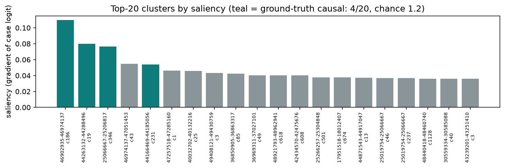

*Figure 16. Cluster saliency of the combined model: ground-truth causal clusters (teal) among the top 20.*

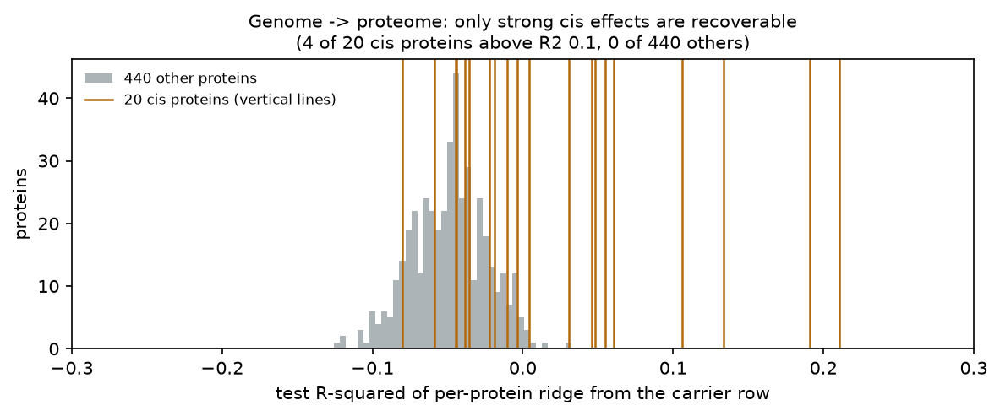

*Figure 17. Per-protein ridge from the genome: only the strong cis effects are recoverable.*

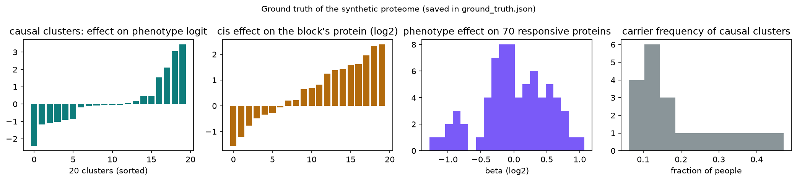

*Figure 18. What was planted: causal-cluster effects on the phenotype, cis effects on proteins, phenotype effects on the
70 responsive proteins, carrier frequencies of the causal clusters.*

### 4.5 Decoder: from numbers to a cited report

The encoder's output for a person is numbers: a class score, 64 coordinates, a ranking of clusters. The decoder turns
them into something a research team can read, without letting the language model invent anything. Worked example,
HG00103 (EUR, GBR, male, site 3, age 29, 994 clusters carried; true label control).

**What the GNN alone gives for HG00103** (all retrieved deterministically from the graph and the trained model):

| Retrieved fact | Value |
|---|---|
| GNN prediction | control (truth: control) |
| Globally salient clusters this person carries | chr22_46902935-46974137_cluster186 (saliency 0.110), chr22_46974137-47051453_cluster43 (0.055), chr22_40032702-40132216_cluster25 (0.046) |
| Most ancestry-informative clusters carried, with the genes and proteins in their block | chr22_40032702-40132216_cluster151 (EAS-enriched; TNRC6B, Q9UPQ9); chr22_35738379-36060254_cluster545 (EAS; RBFOX2, O43251); chr22_26024448-26060666_cluster35 (EUR; MYO18B, Q8IUG5) |
| Most extreme protein levels (harmonised z) | P07305 / H1-0 +2.75; Q9UFD9 / RIMBP3 -2.65; Q15735 / INPP5J +2.53; P53673 / CRYBA4 +2.52; Q04917 / YWHAH +2.37 |
| Nearest people in the 64-d embedding | HG01767 (EUR, IBS), NA12842 (EUR, CEU), HG00351 (EUR, FIN), HG04002 (SAS, ITU), HG00336 (EUR, FIN) |

**What the decoder returns** (Nemotron 3 Super on NVIDIA NIM, 13.3 s, 4,555 prompt tokens, 1,020 completion tokens):

| Field | Text returned |
|---|---|
| summary | Individual HG00103 is of EUR ancestry (GBR population) and carries 994 haploblock clusters. The GNN phenotype prediction for this individual is 'control', which is a synthetic case/control label used for pipeline testing. Several ancestry-informative clusters are carried, showing high enrichment in various populations including EUR, EAS, and SAS. |
| ancestry_assessment | The individual's ancestry is EUR (European) as per the 1000G panel data, with population label GBR. This reflects population structure, not a medical finding. |
| phenotype_assessment | The GNN-predicted phenotype is 'control', which is a synthetic case/control label used to test the pipeline; it does not reflect a real medical condition. |
| caveats | Ancestry labels reflect population structure and are not medical findings. The phenotype is synthetic. Not all carried clusters have gene or protein annotations. The GNN prediction is based on the embedding and may not correlate with observed protein levels. |
| citation check | 25 ids cited, 0 unknown (every id exists in the retrieved context) |

Genome-to-proteome links the decoder wrote, each traceable to graph ids:

| Cluster carried | Block | Gene in the block | Protein | Observation |
|---|---|---|---|---|
| chr22_40032702-40132216_cluster151 | chr22_40032702-40132216 | TNRC6B | Q9UPQ9 | carried by individual, enriched in EAS |
| chr22_35738379-36060254_cluster545 | chr22_35738379-36060254 | RBFOX2 | O43251 | carried by individual, enriched in EAS |
| chr22_26024448-26060666_cluster35 | chr22_26024448-26060666 | MYO18B | Q8IUG5 | carried by individual, enriched in EUR |

A second person, HG00096 (not in the held-out split, run on a fresh clone): the decoder reported that no prediction
exists for them rather than inventing one, backed the EUR label with carrier fractions it read from the context
("chr22_26024448-26060666_cluster35 at 0.952 ... consistent with the EUR ancestry label"), listed six genome-to-proteome
links including CELSR1 / Q9NYQ6 and PPARA / Q6NVV7, and cited 24 ids with 0 unknown in 10.8 s.

**What the LLM adds, and what it does not.** It adds the sentence layer: one paragraph a clinician or biologist can read,
the genome-to-protein chain (cluster carried, block, gene, protein) spelled out per person, the right hedges attached
automatically (population structure is not a medical finding, the phenotype is synthetic), graceful handling of missing
information, and traceability, because every claim carries an id that the code verifies against the retrieved facts.
It does not make predictions, does not add outside knowledge, and cannot cite anything the graph did not provide; the
wording and the number of ids it chooses to cite vary between calls, the citation check does not.

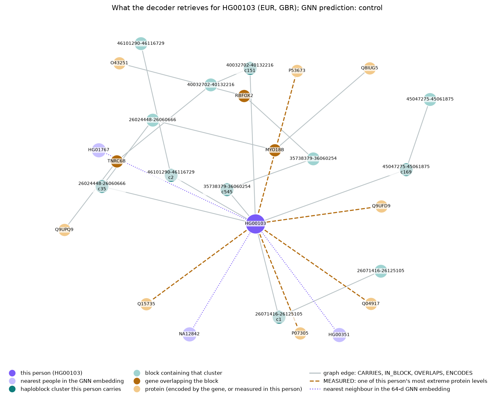

*Figure 19. What the decoder retrieves for one person: clusters with blocks, genes and proteins, extreme protein levels,
nearest neighbours in the embedding.*

### 4.6 Federated: no loss, no data movement

| Model | Balanced accuracy | AUC | Evaluated on |
|---|---|---|---|
| federated, 10 rounds x 5 epochs | 0.89 | 0.955 | the same 376 held-out people |
| federated, 30 rounds x 5 epochs | 0.963-0.971 | **0.987-0.998** (three runs) | the same 376 held-out people |
| central model (train_gnn_v2, both / raw) | 0.953-0.969 | 0.992-0.995 | the same 376 held-out people |
| federated model per site (30 rounds) | 0.98 / 0.98-0.99 / 0.93 | 0.999 / 1.000 / 0.968-0.997 | each site's own held-out people |

**Each site alone versus the federated model.** `federated/local_only.py` trains a model at each site on that site's
people only, for the same number of optimizer steps the federated clients used, and scores it on the same held-out people
as the federated global model. Two budgets were run on the A100: 150 steps per site (30 rounds x 5 epochs) and 50 steps
(10 rounds x 5 epochs). AUC / balanced accuracy on each site's own held-out people:

| Site (held-out n) | Alone, 150 steps | Federated, 150 steps | Alone, 50 steps | Federated, 50 steps |
|---|---|---|---|---|
| SITE1 (111) | 0.998 / 0.952 | 0.999 / 0.983 | 0.881 / 0.543 | 0.998 / 0.950 |
| SITE2 (136) | 0.986 / 0.852 | 1.000 / 0.991 | 0.902 / 0.772 | 0.991 / 0.907 |
| SITE3 (129) | 0.988 / 0.923 | 0.968 / 0.933 | 0.915 / 0.830 | 0.989 / 0.865 |
| **Average over sites** | **0.991 / 0.909** | **0.989 / 0.969** | **0.899 / 0.715** | **0.993 / 0.907** |
| Pooled 376 people, federated global model | - | 0.987 / 0.967 | - | 0.991 / 0.901 |
| Pooled 376 people, central model (all data in one place) | 0.995 / 0.960 | | 0.997 / 0.959 | |

A lone site's model also has to work on other hospitals' patients. Test AUC of each model on each site's held-out
people (150 steps; rows = where the model was trained, columns = whose patients it is scored on):

| Model trained at | on SITE1 people | on SITE2 people | on SITE3 people |
|---|---|---|---|
| SITE1 alone | 0.998 | 0.982 | 0.949 |
| SITE2 alone | 0.993 | 0.986 | 0.969 |
| SITE3 alone | 0.997 | 0.998 | 0.988 |
| **Federated global model** | **0.999** | **1.000** | **0.968** |

Reading. With a full budget a lone site is nearly as good as the federated model on AUC (0.991 vs 0.989 on average)
but clearly worse on balanced accuracy (0.909 vs 0.969), because a single site's threshold is calibrated on its own
case mix. With the smaller budget the gap opens: lone sites average 0.899 AUC and 0.715 balanced accuracy, the federated
model 0.993 and 0.907, because the averaged weights have effectively seen every site's people. Federation therefore costs
nothing when a site has enough data and budget, helps clearly when it does not, and in both cases solves the constraint:
one model trained on everyone with no row leaving a site. A larger gain is expected with ancestry-pure sites.

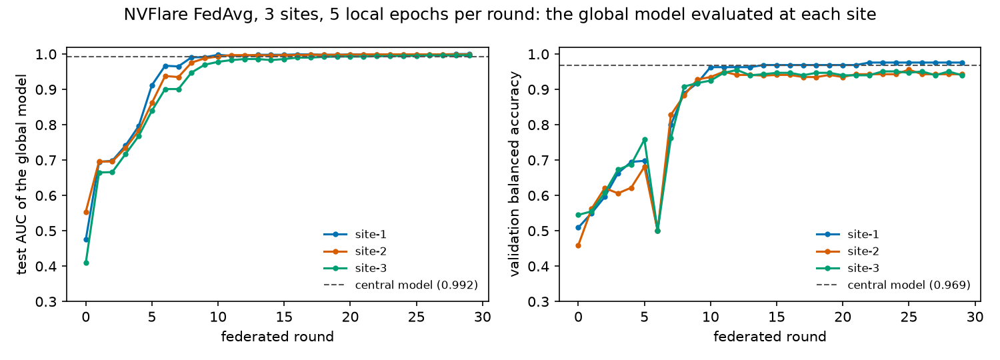

*Figure 20. Global-model AUC and validation balanced accuracy at each site per round, against the central model.*

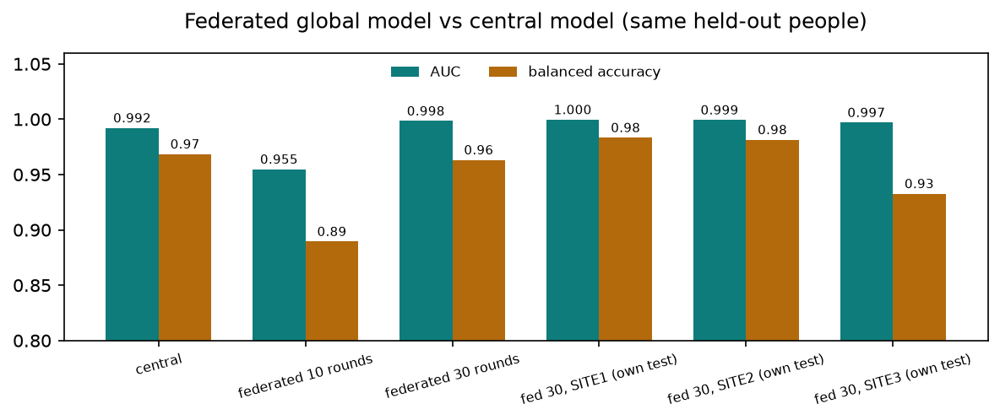

*Figure 21. Central versus federated (10 and 30 rounds) on the same held-out people, and per site.*

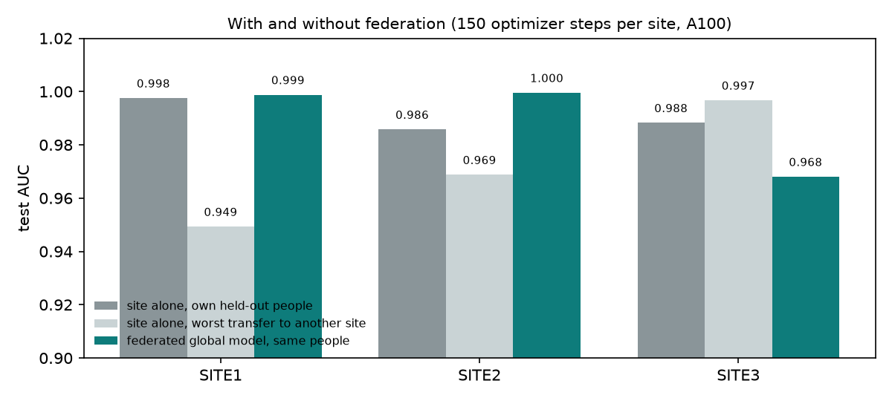

*Figure 22. Each site trained alone versus the federated global model on the same per-site held-out people.*

### 4.7 Compute

| Quantity | Laptop (M2 CPU) | A100 80 GB |
|---|---|---|
| GNN epoch (full graph) | 0.95 s | 0.10 s |
| whole chain from an empty folder | ~30 min | ~14 min incl. image build |
| full-graph inference, eager -> torch.compile | - | 36.3 ms -> 4.9 ms (7.4x, logits equal to 2e-6) |
| Torch-TensorRT | - | did not finish compiling this scatter-heavy hetero-GNN in 3 h; not claimed |

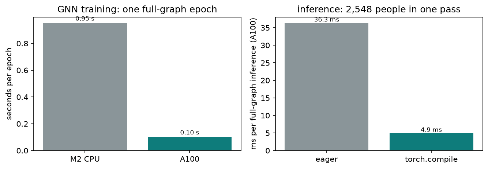

*Figure 23. Epoch time laptop vs A100; inference eager vs torch.compile.*

### 4.8 Reproduction

Before the commit the chain was re-run from the committable files as a fresh clone on the laptop and through the rebuilt
Docker image on the A100. Every count is identical; every score is within run-to-run noise.

| Quantity | Documented | Fresh clone, laptop | Rebuilt image, A100 |
|---|---|---|---|
| clusters / CARRIES / CO_OCCURS / MEASURED | 6,551 / 2,365,574 / 187,030 / 1,065,712 | identical | identical |
| ancestry-associated clusters / sex | 6,470 / 0 | 6,470 / 0 | 6,470 / 0 |
| baseline ancestry / population / sex | 0.977 / 0.614 / 0.463 | 0.977 / 0.614 / 0.463 | 0.981 / 0.614 / 0.463 |
| GNN ancestry / population / sex (SVD) | 0.974 / 0.437 / 0.503 | 0.974 / 0.437 / 0.503 | Node2Vec: 0.950 / 0.292 / 0.489 |
| phenotype AUC genome / proteome / both | 0.64 / 0.96 / 0.99 | 0.65 / 0.96 / 0.99 | 0.64 / 0.96 / 0.99 |
| site control (chance 0.33) | 0.30 | 0.34 | 0.30 |
| saliency hits in top 20; ridge cis / other | 4; 4 / 0 | 4; 4 / 0 | 4; 4 / 0 |
| federated AUC / central AUC | 0.998 / 0.992 | 0.996 / 0.994 | 0.987 / 0.995 |
| decoder cited / invented | 25 / 0 | 4 / 0 | dry run |
| unit tests | 11 pass | 11 pass | 11 pass (in the build) |

---

## 5. Exploratory data analysis (selected)

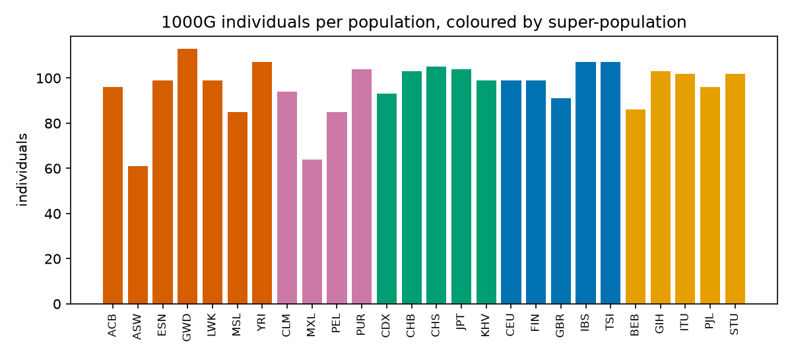

*Figure 24. 1000G individuals per population, coloured by continental ancestry (2,503 labelled: AFR 660, EAS 504,
EUR 503, SAS 489, AMR 347).*

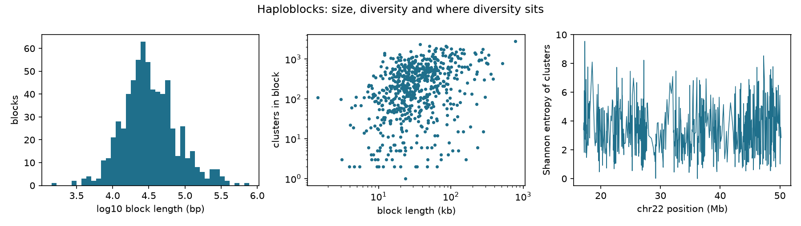

*Figure 25. Haploblocks: length (median 29.7 kb), clusters per block versus length, entropy along the chromosome.*

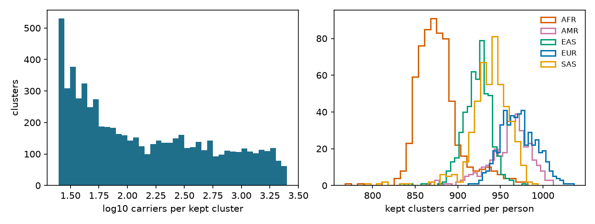

*Figure 26. Kept clusters: carriers per cluster and clusters carried per person (~928) by ancestry.*

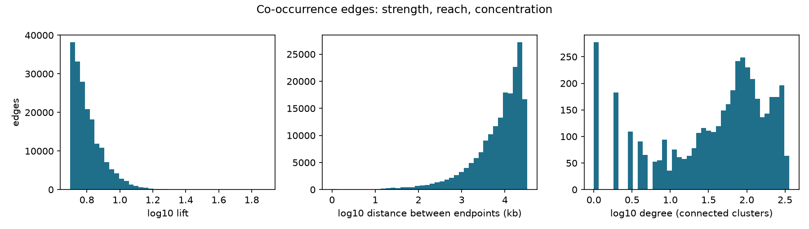

*Figure 27. Co-occurrence edges: lift (median 5.5, max 76), distance between endpoints (tens of Mb), degree (max 358; the
top hubs are AFR-enriched rare clusters, the mega-hub artefact).*

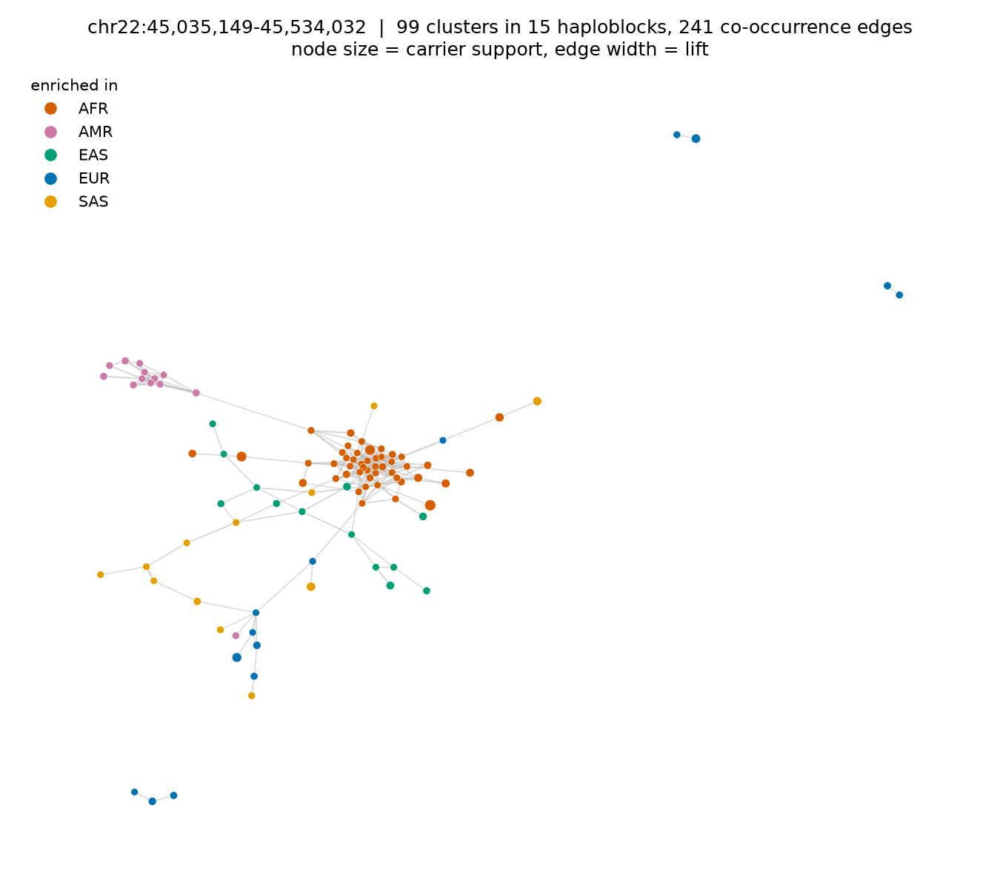

*Figure 28. The densest published island of chr22: clusters coloured by the ancestry they are enriched in.*

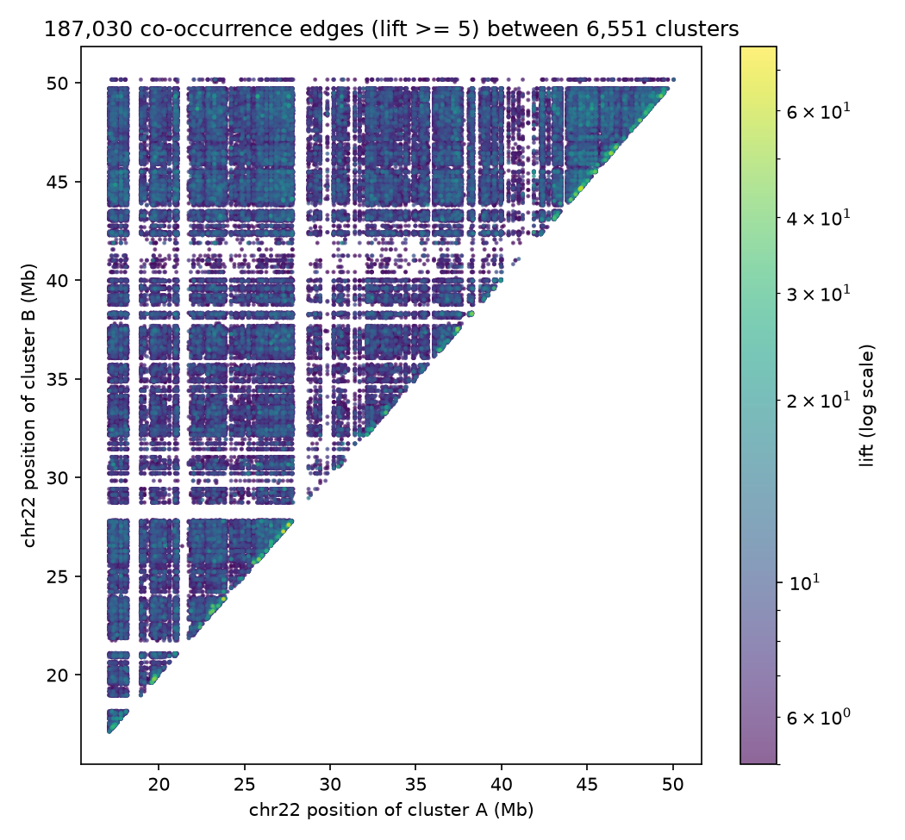

*Figure 29. All 187,030 edges by the positions of their endpoints: block structure and long-range population structure.*

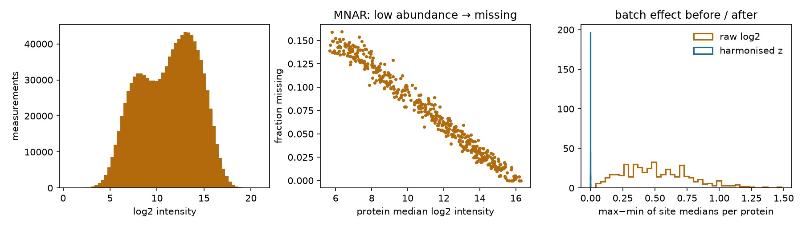

*Figure 30. Synthetic proteomics: intensity distribution, missingness rising for low-abundance proteins (7.4 % overall,
up to 16 %), batch effect between sites before and after the harmoniser.*

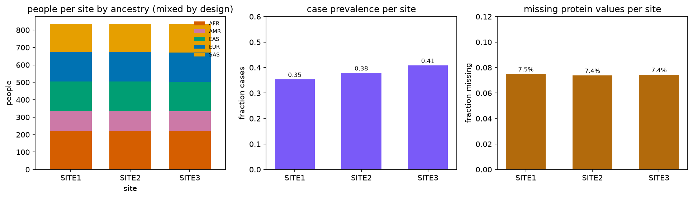

*Figure 31. The three federated sites: people per site by ancestry (mixed by design), case prevalence, missing values.*

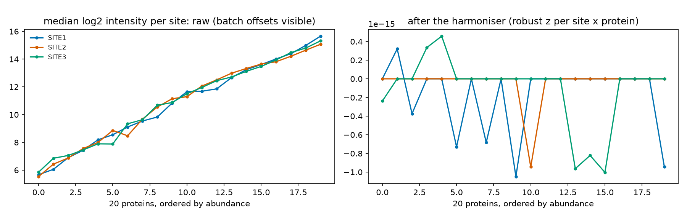

*Figure 32. Per-site protein medians before and after harmonisation: the batch offsets vanish.*

---

## 6. What is claimed and what is not

* The case/control phenotype is synthetic: the integration numbers show the pipeline recovers a planted signal, not
  biology. Ancestry, population and sex results are on real labels.
* Chromosome 22 only; nothing in the code is chromosome-specific (`CHROM=chr21 make run`).
* On single-label accuracy the GNN ties, not beats, logistic regression; its value is the embedding space and the
  integration.
* The GNN embedding does not recover single-cluster cis effects; a per-protein ridge does for the strong ones.
* Federated evaluation reuses the central held-out people; a real deployment reports per site only. Federation is run in
  the NVFlare simulator, not across real machines.
* TensorRT is not part of the inference claim; torch.compile is.

## 7. How this fits with the team's proteomics work

The team's proteomics work on `main` (synthetic proteomics generator, protein filtering and classification baselines,
the protein-centred knowledge graph, the federated comparison and `methods_and_results.md`) covers the proteome side and
the federated logistic setting. `genomics/` adds the genome side: the person-level knowledge graph built on the 1000
Genomes ids, the graph neural network, the LLM decoder and the NVFlare run. The two share the same HaploGraph edge file,
the same UniProt gene BED and the same three-site design, and they are complementary rather than overlapping: nothing in
`genomics/` touches a path on `main`, and for the manuscript the proteomics analysis and the graph model plug into the
same methods and results structure.

## 8. Next steps

1. Ancestry-pure sites: the federated experiment where FedAvg must fight client drift and site-alone models fail to
   transfer.
2. Real proteomics: Wu et al. 2013 (95 HapMap LCLs with 1000G ids) as a real fourth site; UKB-PPP cis-pQTLs (AWS Open
   Data) as Cluster -> Protein propensity edges.
3. NVFlare POC mode across real machines (the L4 and the A100 as two sites); per-site held-out reporting only.
4. More chromosomes, then the whole genome, with the same code.

## 9. Reproduce

```bash
git clone https://github.com/collaborativebioinformatics/ProGenome.git && cd ProGenome && git checkout modelling && cd genomics
make setup && make run && make run-v2 && make federated ROUNDS=30 LOCAL_EPOCHS=5     # ~30 min on a laptop CPU
cp .env.example .env   # add NVIDIA_API_KEY for the decoder, then: make decode WHO=HG00103
make report            # regenerates every figure on this page and the PDF / DOCX / LaTeX report
```

The [README](README.md) has the full implementation guide, the expected output of every stage and a troubleshooting table.
