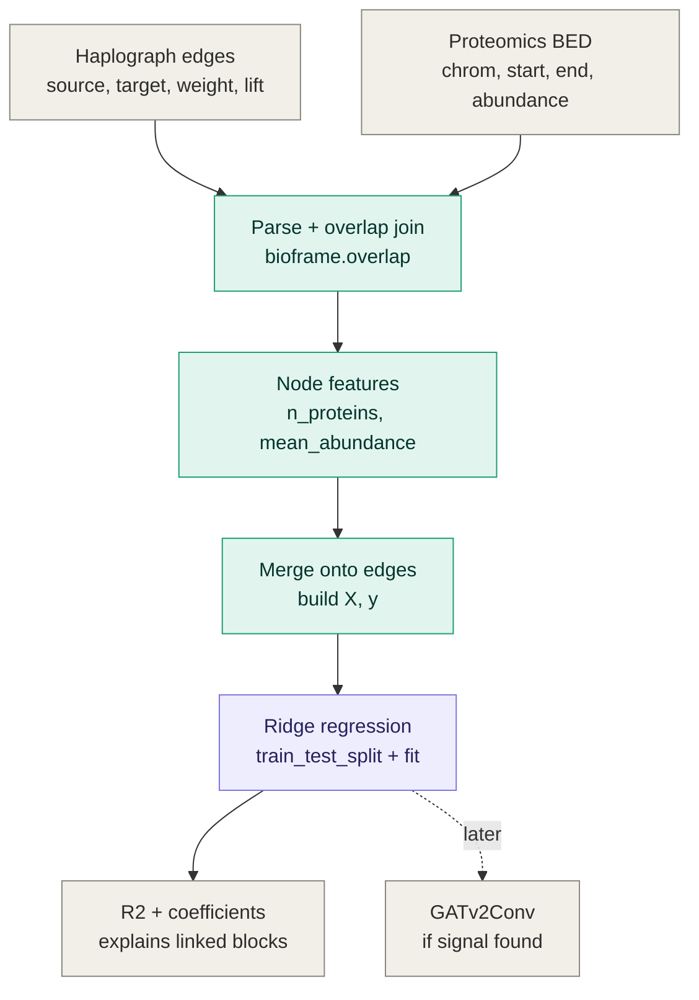

# Haplograph + proteomics: do linked blocks share protein signal?

Of the questions we considered, this is the one buildable today — the
data already exists, no per-patient information or GNN required.

## Overview



## 1. The data

Haplograph edges (`edges_lift_above_threshold.csv.gz`):

```
source,target,weight,lift
chr22_17420471-17463955_cluster123,chr22_17573553-17596894_cluster65,7,5.50494
chr22_17420471-17463955_cluster123,chr22_17795362-17851807_cluster742,5,5.30833
chr22_17420471-17463955_cluster123,chr22_23355114-23374984_cluster99,9,10.0579
```

- **Node** = a haploblock region + its cluster assignment
  (e.g. `chr22_17420471-17463955_cluster123`).
- **weight** = how many individuals carry both cluster assignments.
- **lift** = how much more often the two clusters co-occur than chance
  predicts (`P(A ∩ B) / (P(A) * P(B))`); values > 1 mean a real association.
- The file is already filtered to statistically-linked pairs only.

Plus a proteomics BED file (protein genomic coordinates + abundance).

## 2. Attach proteomics to each block

```python
import pandas as pd
import bioframe as bf

edges = pd.read_csv("edges_lift_above_threshold.csv.gz")  # source,target,weight,lift

def parse_node(node_id):
    chrom, rest = node_id.split("_", 1)
    coords, cluster = rest.rsplit("_", 1)
    start, end = coords.split("-")
    return chrom, int(start), int(end), cluster

nodes = pd.DataFrame({"node_id": pd.unique(edges[["source", "target"]].values.ravel())})
nodes[["chrom", "start", "end", "cluster"]] = nodes["node_id"].apply(
    lambda n: pd.Series(parse_node(n))
)

proteomics = pd.read_csv(
    "proteomics.bed", sep="\t",
    names=["chrom", "start", "end", "protein_id", "abundance"],
)

overlaps = bf.overlap(nodes, proteomics, how="left", suffixes=("", "_prot"))

node_features = (
    overlaps.groupby("node_id")
    .agg(n_proteins=("protein_id_prot", "count"),
         mean_abundance=("abundance_prot", "mean"))
    .fillna(0)
    .reset_index()
)
```

## 3. The model: predict `lift` from the two blocks' protein features

```python
df = (
    edges
    .merge(node_features.add_suffix("_src"), left_on="source", right_on="node_id_src")
    .merge(node_features.add_suffix("_tgt"), left_on="target", right_on="node_id_tgt")
)

X = df[["n_proteins_src", "mean_abundance_src",
        "n_proteins_tgt", "mean_abundance_tgt", "weight"]]
y = df["lift"]

from sklearn.linear_model import Ridge
from sklearn.model_selection import train_test_split

X_train, X_test, y_train, y_test = train_test_split(X, y, test_size=0.2, random_state=0)
model = Ridge(alpha=1.0).fit(X_train, y_train)
print("R^2:", model.score(X_test, y_test))
```

**Blind spot:** the edge list only contains already-linked pairs, so this
explains *why* linked blocks are linked — it doesn't predict whether two
arbitrary blocks would link at all.

## 4. If this shows signal (later, not now)

Swap Ridge for a GATv2Conv layer, same target (`lift`). Two reasons to pick
it over plain Ridge at that point: it lets each block's *neighbors* in the
graph contribute too, not just the two endpoints, and it can use `weight`
and `lift` together as edge features instead of collapsing them into one
number.
