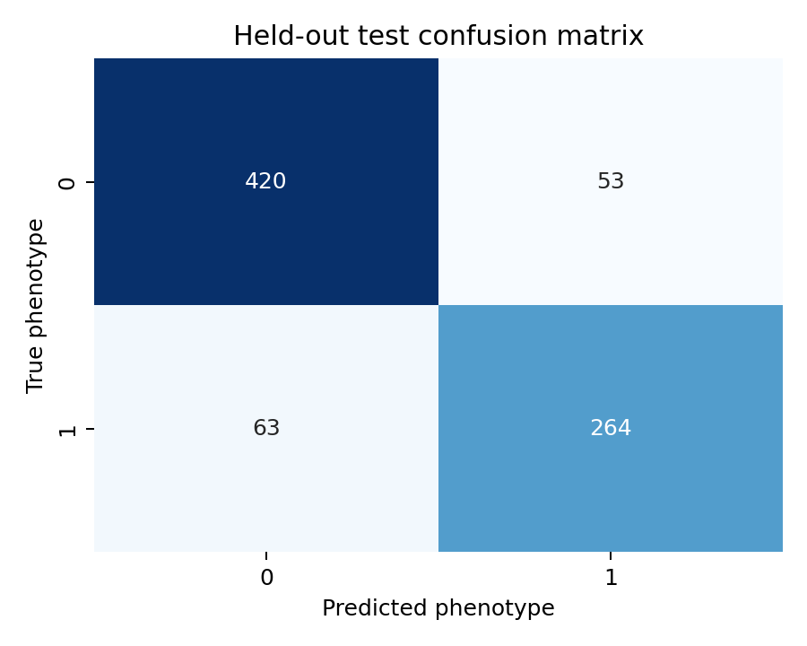
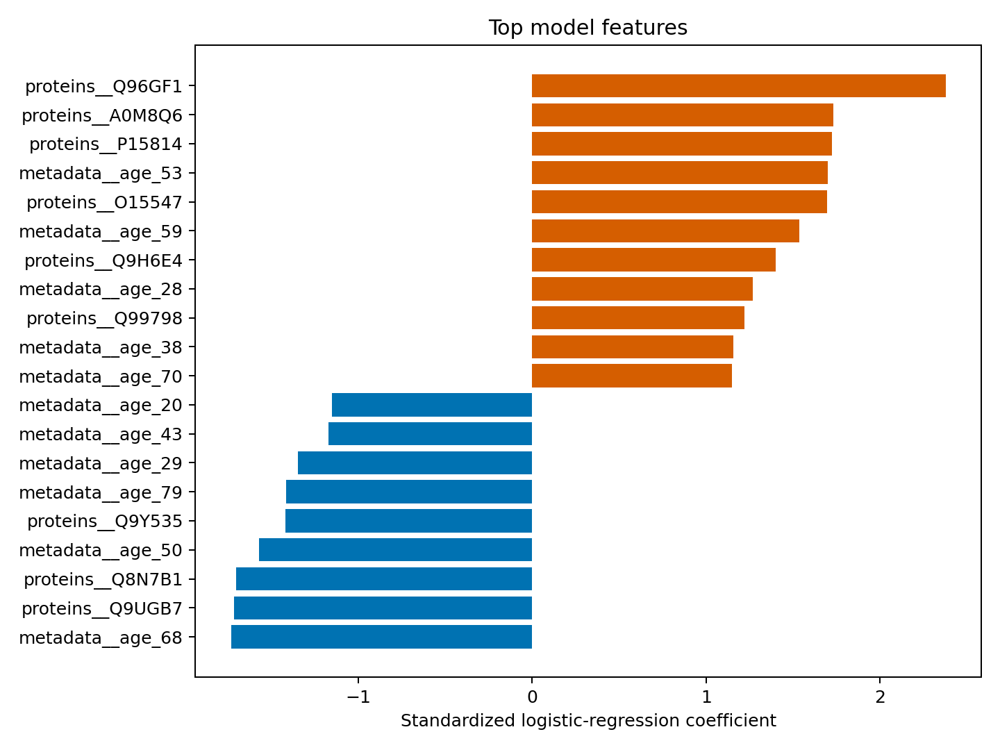
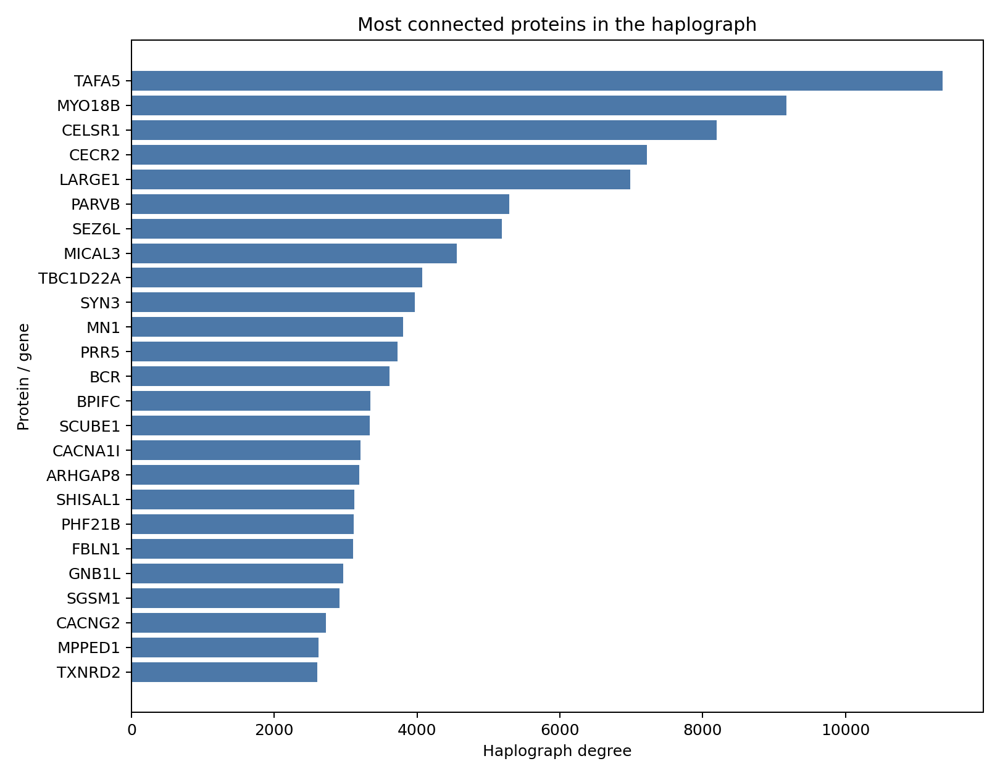
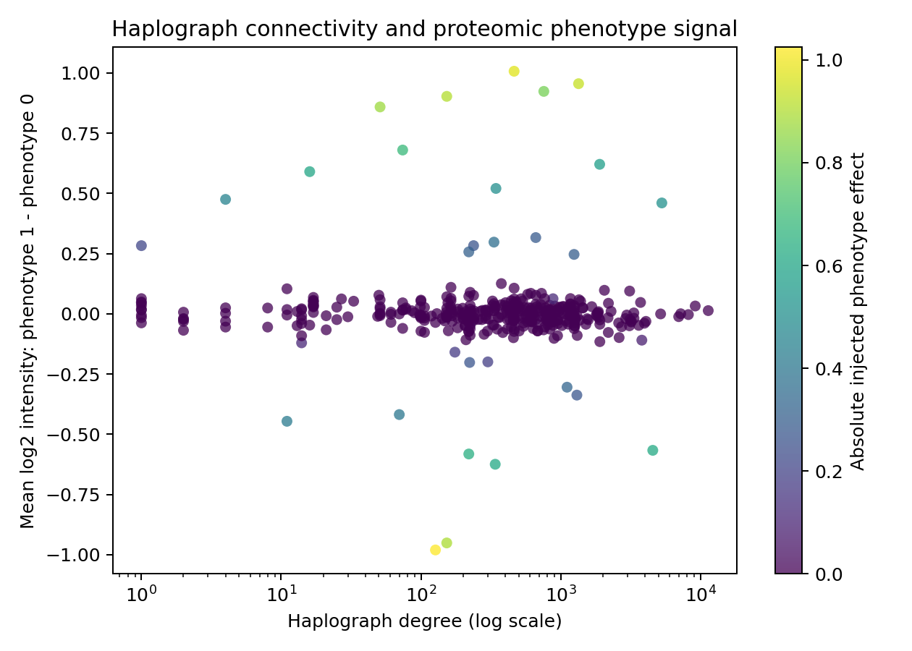
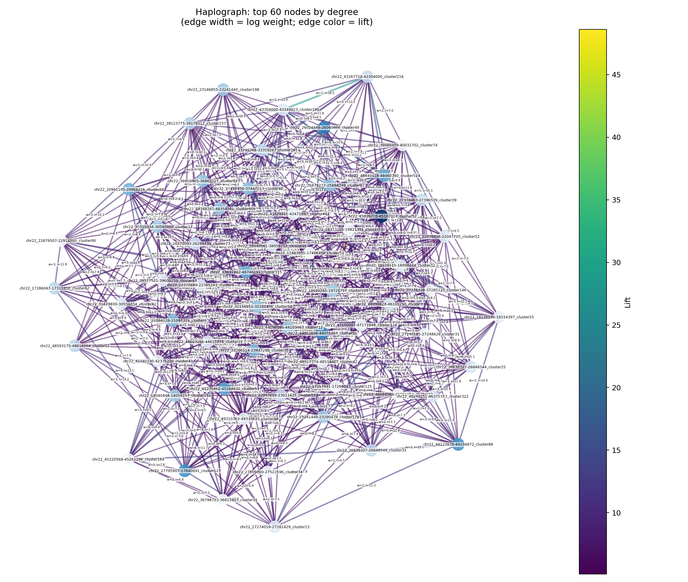
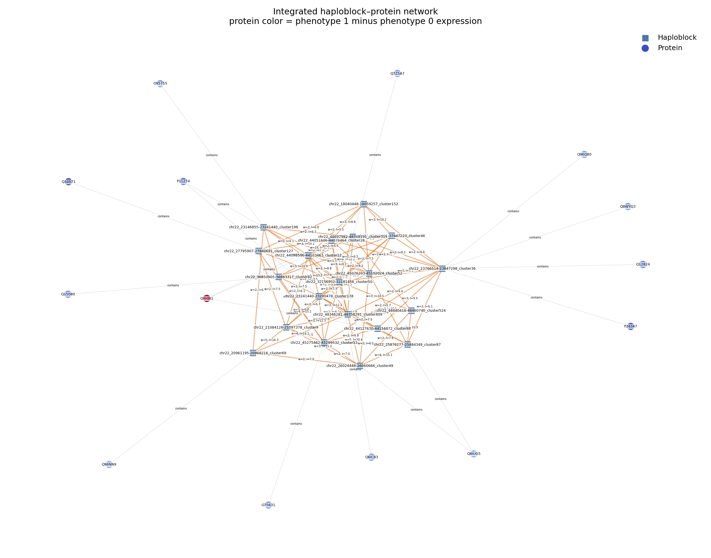
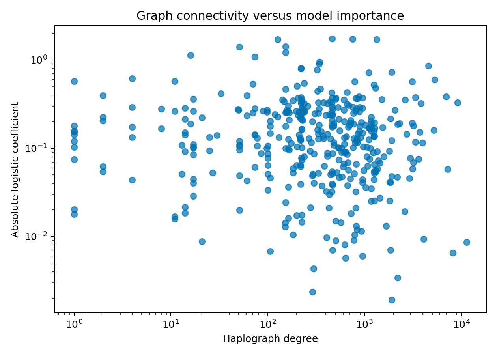

# Methods and Results: Federated Proteomics, Haplographs, and Graph Learning

This page presents the chromosome 22 proof-of-concept analysis in a format
that renders directly on GitHub. The figures are ordered from simple
classification summaries to increasingly complex graph views.

## 1. Methods

### Data integration and preprocessing

Three site-specific chromosome 22 proteomics matrices were read with
**pandas** and converted from protein-by-sample to sample-by-protein format.
They were joined to age, sex, site, and binary case/control phenotype
metadata, giving 4,000 samples and 460 measured proteins. **NumPy** was used
for numerical transformations and missing-value handling.

Samples were divided into an 80% training set and a 20% held-out test set
using a fixed random seed. Stratification used the joint site-by-phenotype
label, preserving case/control proportions within each site. Protein
filtering was learned from training samples only:

- Detection rate at least 80%
- Median log2 intensity at least 6
- Variance at least 0.01
- For protein pairs with absolute Pearson correlation above 0.8, retain the
  higher-variance protein

### Logistic-regression model

The reference classifier was implemented with **scikit-learn**. Median
imputation and standardization were placed inside the model pipeline. A
class-balanced logistic-regression model used protein abundances together with
age, sex, and site. Performance was measured with five-fold stratified
cross-validation on the training set and final evaluation on the untouched
test set.

Reported metrics were accuracy, balanced accuracy, precision, recall, F1
score, ROC AUC, and a confusion matrix.

### Haplograph and knowledge graph

The annotated haplograph edge list was processed with **pandas** and
represented with **NetworkX**. Haploblock co-occurrence edges retained their
observed `weight` and `lift` values. Genomic overlap annotations supplied
haploblock-to-protein membership edges.

Protein nodes were linked to gene symbols and measurement sites and annotated
with:

- Haplograph degree
- Total graph weight
- Total graph lift
- Mean protein abundance
- Detection rate
- Phenotype-associated abundance difference

NetworkX was also used for degree summaries, interpretable subgraph selection,
and network layouts. The full graph is retained in CSV files; figures use labeled high-degree
subsets so that node identities and edge statistics remain readable.

### PyTorch Geometric comparison

A separate graph-neural-network baseline was implemented with **PyTorch** and
**PyTorch Geometric (PyG)**. Each patient was represented as a graph over the
shared 397-protein network. Each protein node contained that patient's
abundance plus standardized haplograph degree, weight, and lift.

Protein–protein edges were projected from annotated haploblock memberships and
restricted to the 2,000 highest-weight projected edges for computational
tractability. The model used two `GCNConv` layers, global mean pooling, and a
small classifier receiving age, sex, and site covariates. The PyG model used
the same stratified split and five-fold training-set cross-validation as the
logistic-regression reference.

## 2. Results

### Logistic-regression performance

| Metric | Five-fold CV mean | Five-fold CV SD | Held-out test |
|---|---:|---:|---:|
| Accuracy | 0.851 | 0.018 | 0.855 |
| Balanced accuracy | 0.847 | 0.019 | 0.848 |
| Precision | 0.815 | 0.027 | 0.833 |
| Recall | 0.823 | 0.027 | 0.807 |
| F1 score | 0.819 | 0.022 | 0.820 |
| ROC AUC | 0.930 | 0.011 | 0.933 |

The held-out confusion matrix contained 420 true negatives, 53 false
positives, 63 false negatives, and 264 true positives.

### Graph size and graph/model comparison

| Graph or comparison quantity | Result |
|---|---:|
| Haploblock nodes | 4,344 |
| Haploblock co-occurrence edges | 187,030 |
| Protein nodes | 397 |
| Gene nodes | 391 |
| Site nodes | 3 |
| Integrated graph edges | 491,898 |
| Proteins compared with logistic regression | 397 |
| Top-20 graph/model overlap | 2 proteins (10%) |
| Spearman degree vs absolute coefficient | −0.088 |
| Spearman lift vs absolute coefficient | −0.087 |

The low overlap and near-zero correlations indicate that graph centrality and
predictive proteomic importance are complementary. A highly connected protein
is central to genomic co-occurrence structure, but it is not necessarily the
protein that best distinguishes the phenotype.

### PyG versus logistic regression

| Model | Test ROC AUC | CV ROC AUC | Test balanced accuracy | Test F1 |
|---|---:|---:|---:|---:|
| Logistic regression | 0.933 | 0.930 ± 0.011 | 0.848 | 0.820 |
| PyG GCN | 0.512 | 0.496 ± 0.018 | 0.500 | 0.580 |

The current PyG GCN is therefore a reproducible baseline, not the strongest
model for this dataset. It was lightly trained and did not yet use attention,
edge attributes, extensive hyperparameter tuning, or the complete projected
protein network.

## 3. Figures

### Figure 1 — Held-out test confusion matrix

The horizontal axis shows the model prediction, while the vertical axis shows
the true phenotype. Each cell is a number of samples: diagonal cells are
correct predictions and off-diagonal cells are errors. The figure is
descriptive and does not by itself provide a p-value or prove statistical
significance.

### Figure 2 — Largest logistic-regression feature coefficients

The horizontal axis is the standardized logistic coefficient and the vertical
axis lists proteins or covariates. Bars to the right increase predicted case
probability and bars to the left decrease it; longer bars indicate stronger
model association after adjustment. These are model coefficients, not
p-values, so they should not be called statistically significant without
confidence intervals or a formal multiple-testing analysis.

### Figure 3 — Most connected proteins in the haplograph

The horizontal axis is haplograph degree and the vertical axis lists proteins
or gene symbols. A longer bar means that the protein is associated with more
annotated haplograph edge records. This indicates network connectivity, not
higher expression or stronger phenotype prediction; no significance test is
shown.

### Figure 4 — Haplograph connectivity versus phenotype signal

Each point is one protein. The x-axis shows haplograph degree on a logarithmic
scale, and the y-axis shows the mean log2 expression difference between
phenotype 1 and phenotype 0. Point color represents the absolute injected
phenotype effect; stronger color means a larger simulated effect. This is an
exploratory visualization, not a statistical significance test.

### Figure 5 — Haplograph-only network

Each labeled node is a high-degree haploblock. Larger nodes have higher degree
in the displayed subgraph. Each edge is labeled with `w` (co-occurrence
weight) and `l` (lift); edge width also represents the logarithm of weight,
while edge color represents lift. Higher lift means stronger co-occurrence
relative to the independence expectation. Lift greater than 1 is an enrichment
measure, but this figure does not show p-values or confidence intervals.

### Figure 6 — Integrated haploblock–proteomics network

Squares represent labeled haploblocks and circles represent labeled proteins.
Grey edges are labeled `contains` and show that a protein maps to or overlaps
a haploblock; orange edges are labeled with `w` and `l` and show haploblock
co-occurrence weight and lift. Protein color represents the difference in mean
log2 abundance between phenotype groups. Colors and line widths are visual
encodings, not statistical significance tests.

### Figure 7 — Graph connectivity versus logistic-regression importance

Each point is one matched protein. The x-axis is haplograph degree on a
logarithmic scale and the y-axis is the absolute standardized logistic
coefficient, also on a logarithmic scale. Points higher up have stronger
model influence regardless of direction, while points farther right are more
network-connected. The weak correlation and low top-20 overlap show different
rankings, but the plot alone does not establish statistical significance.

## 4. Reproducibility and files

Main scripts:

- [`scripts/analyze_proteomics.py`](scripts/analyze_proteomics.py)
- [`scripts/build_knowledge_graph.py`](scripts/build_knowledge_graph.py)
- [`scripts/plot_haplograph_comparison.py`](scripts/plot_haplograph_comparison.py)
- [`scripts/run_pyg_comparison.py`](scripts/run_pyg_comparison.py)

Result directories:

- [`proteomics/logistic_regression_results/`](proteomics/logistic_regression_results/)
- [`proteomics/knowledge_graph/`](proteomics/knowledge_graph/)
- [`proteomics/graph_comparison/`](proteomics/graph_comparison/)
- [`proteomics/pyg_results/`](proteomics/pyg_results/)
